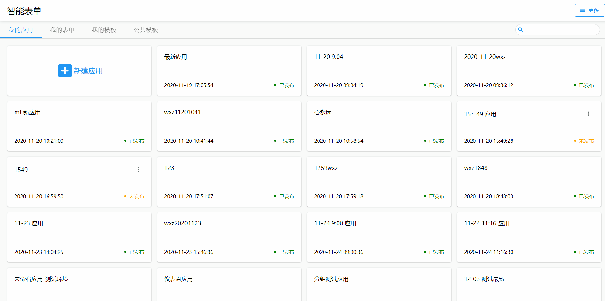
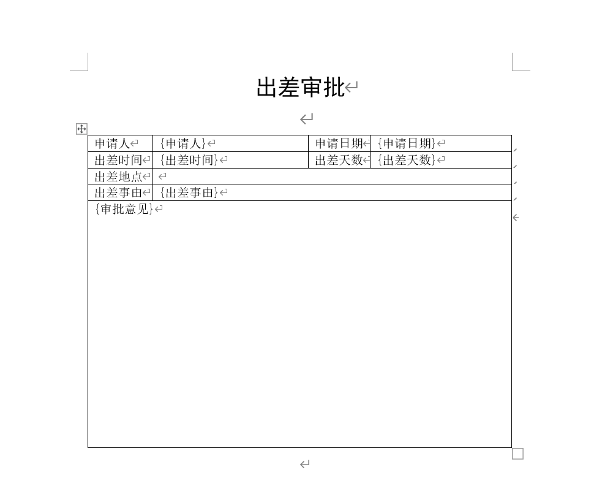
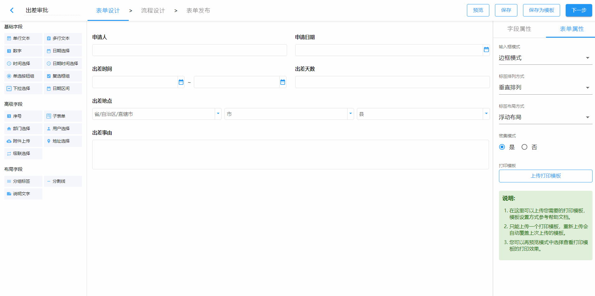
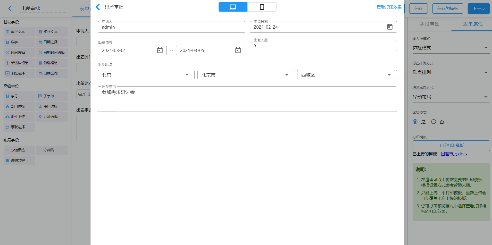
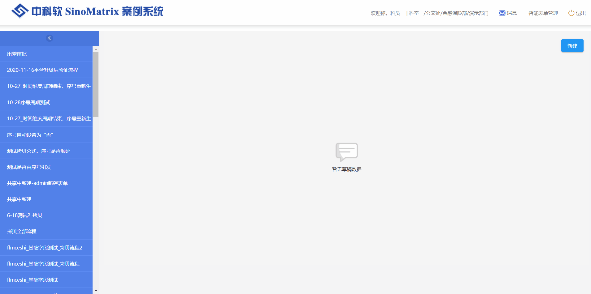
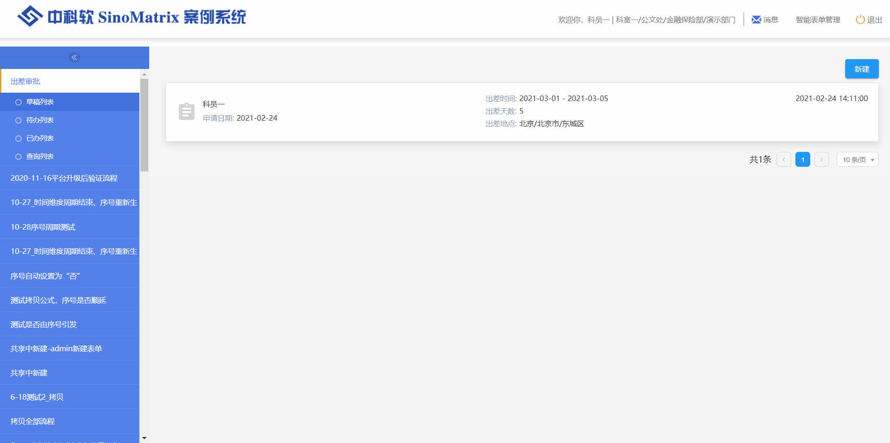
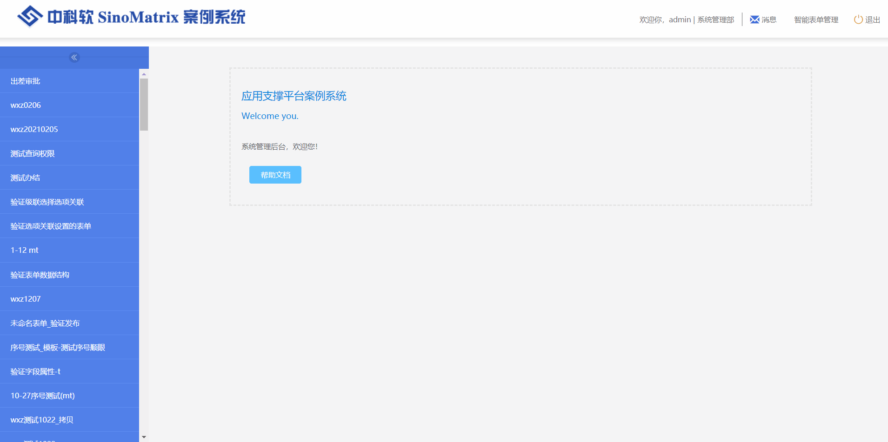

#  出差审批

## 表单设计

### 打印模板

**制作打印模板**

**上传打印模板**

## 预览效果

**查看打印输出效果**

## 流程设计

出差审批流程设置为科员申请->科长审批->结束节点。

## 表单发布

将admin设置为数据查看人员并发布。

## 使用表单

### 起草

科员一登录起草数据。

### 流程流转

科员一将起草的数据发送给科长。

### 待办列表

科长一登录后处理待办。

### 已办列表

科长一查看已办数据。

### 查询列表

数据查看人员admin登录后查看出差审批数据。

