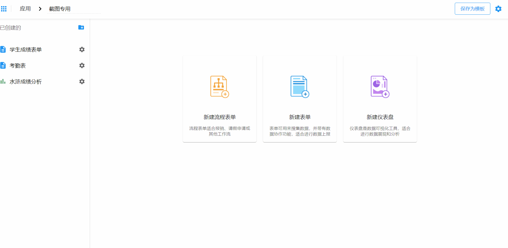
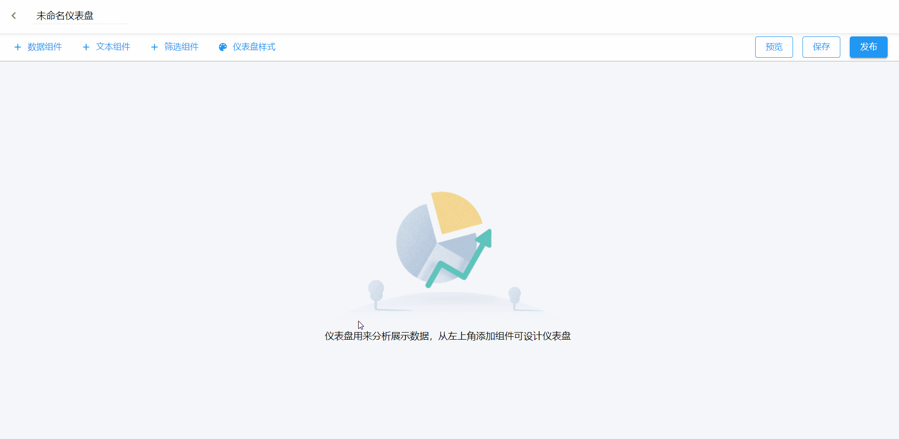

# 仪表盘

仪表盘用来对已发布的表单产生的数据进行汇总、分析。

## 设置步骤

**`应用`** >> **`新建仪表盘`**

## 效果查看

**本章内容：**

1. [数据组件](dashboard-chart.md)
2. [文本组件](text.md)
3. [筛选组件](filter.md)
4. [仪表盘样式](theme.md)
5. [仪表盘发布](publish.md)
