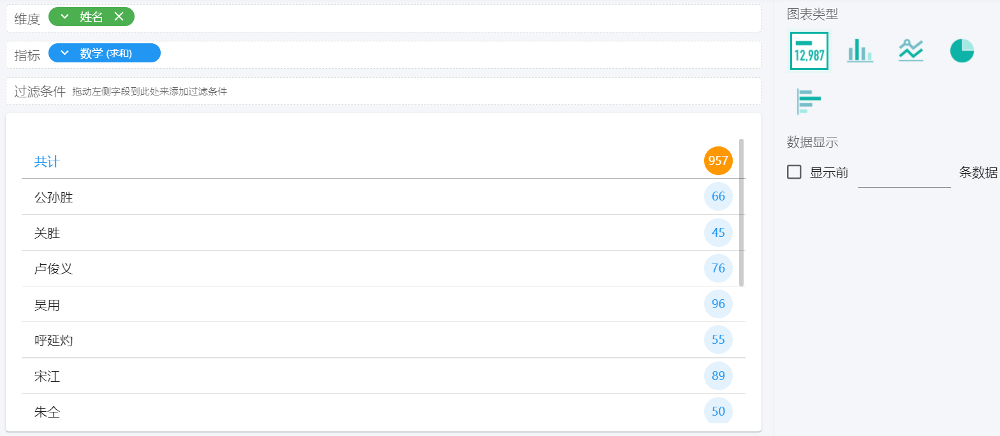
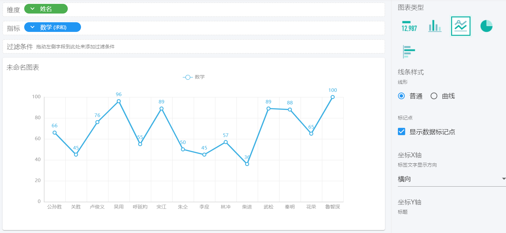
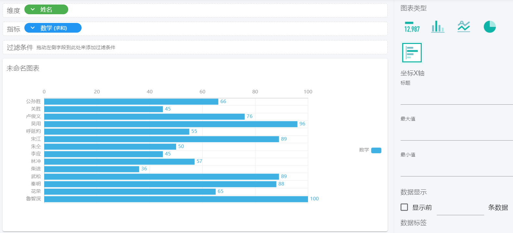

# 图表的应用

- [特点介绍](#特点介绍)
  - [指标图](#指标图)
  - [柱状图](#柱状图)
  - [折线图](#折线图)
  - [饼图](#饼图)
  - [条形图](#条形图)

- [指标说明](#指标说明)

## 特点介绍

### 指标图

指标图是数据最直观的体现，常用来对某个数据的监测，根据指标的值衡量是否符合预定要求。

- 单指标。可用来计数或求总和

- 单维度单指标。

### 柱状图

用来显示一段时间内数据的变化或者各组数据之间的比较关系。通常横轴为分类项，纵轴为数值项。

### 折线图

将同一系列的数据在图中表示成点并用直线连接起来，适用于显示某段时间内数据的变化及其变化趋势。

### 饼图

只适用于单个数据系列间各数据的比较，显示数据系列中每一项占该系列数值总和的比例关系，比例总和只能是100%。

### 条形图

类似于柱形图，强调各个数据项之间的差别情况。纵轴为分类项，横轴为数值项，这样可以突出数值的比较。

## 指标说明

各类图表的说明如下:

| 图表类型 | 支持维度/指标                            |
| -------- | ---------------------------------------- |
| 指标图   | 0个维度，1个指标；1个维度，1个指标       |
| 柱形图   | 1个维度，1个或多个指标；2个维度，1个指标 |
| 折线图   | 1个维度，1个或多个指标；2个维度，1个指标 |
| 饼图     | 1个维度，1个指标                         |
| 条形图   | 1个维度，1个或多个指标；2个维度，1个指标 |

