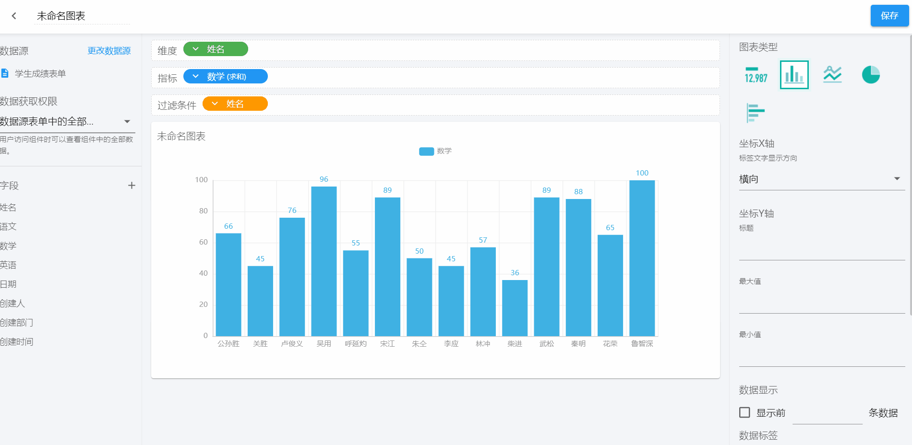
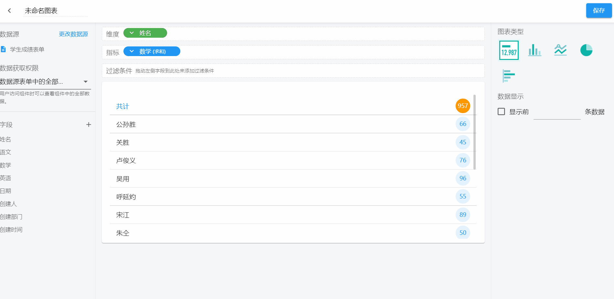

# 数据组件

仪表盘数据组件主要对数据源表单的数据进行分析和展示。

- [名词解释](#名词解释)
  - [(1)数据源](#数据源)
  - [(2)数据获取权限](#数据获取权限)
  - [(3)字段](#字段)
  - [(4)维度](#维度)
  - [(5)指标](#指标)
  - [(6)过滤条件](#过滤条件)
  - [(7)图表类型](#图表类型)
  - [(8)坐标 X 轴](#坐标X轴)
  - [(9)坐标 Y 轴](#坐标Y轴)
  - [(10)数据显示](#数据显示)
  - [(11)显示图例](#显示图例)
- [统计表](#统计表)
  - [(1)名称设置](#名称设置)
  - [(2)更改数据源](#更改数据源)
  - [(3)维度设置](#维度设置)
    - [添加维度](#添加维度)
    - [维度字段设置](#维度字段设置)
  - [(4)指标设置](#指标设置)
    - [添加指标](#添加指标)
    - [指标字段设置](#指标字段设置)
  - [(5)过滤条件](#过滤条件)
    - [添加过滤条件](#添加过滤条件)
    - [过滤条件设置](#过滤条件设置)
  - [(6)图表类型](#图表类型)
  - [(7)数据显示](#数据显示)
  - [(8)坐标 X 轴](#统计表x轴)
  - [(9)坐标 Y 轴](#统计表Y轴)
  - [(10)数据标签](#数据标签)
  - [(11)辅助线](#辅助线)
- [图表大小及位置调整](#图表大小及位置调整)
- [图表复制及删除](#图表复制及删除)

## 名词解释

### (1)数据源

即所需要进行汇总分析的表单。

### (2)数据获取权限

统计数据权限范围：

- 数据源表单中的全部数据

数据源表单中的数据权限指的就是不管成员在表单中的权限是怎样的，在访问该仪表盘组件时，里面所有的数据都是可见的。如，明细表，那么所有成员对每一条明细数据皆可查看；如果是统计表，那么展示的就是所有数据统计汇总的结果。

- 使用成员对数据源表单的权限

在设置完表单后会给成员分配不同的操作权限，当该表单被选择为仪表盘的数据源时，可以沿用成员在该表单中的数据权限。如，成员 A 可以查看所有数据权限，成员 B 仅查看自己的数据权限，那么他们在仪表盘中的数据查看权限将会有所不同。

### (3)字段

数据源表单中的字段。

### (4)维度

统计表的维度指我们分析数据的角度。比如，可以从时间维度分析不同月份/年份的销售额变化，可以从地域维度分析不同省/市的销售额。其中的月份/年份、省/市等就是维度。从不同的维度去分析数据，可以让我们对数据有更全面的认识和了解，也能让我们更好的制定计划和决策。

### (5)指标

指标是对维度的量化，维度讲究的是从不同的角度出发去分析数据，而指标就是不同维度分析出来的结果，这个结果可以是数值，也可以是比值。不同月份/年份的销售额、不同省/市的销量占比，其中的销售额、销量占比就是我们量化的指标。通过指标的量化，可以让我们精准的看到业务产出，从而更好的衡量目标达成的结果。

### (6)过滤条件

统计表的数据可以进行过滤，只显示满足过滤条件的数据。

### (7)图表类型

不同的图表类型支持的`维度`和`指标`不同，用户可以根据自己需要的`维度`和`指标`选择合适的图表类型。目前支持的图表类型有：指标图、柱形图、折线图、饼图和条形图。

### (8)坐标 X 轴

设定标签文字显示方向，支持横向、竖向、左倾斜、右倾斜。

### (9)坐标 Y 轴

坐标 Y 轴可以可以设置 Y 轴的标题、最大值、最小值。

### (10)数据显示

显示前 N 条数据。

### (11)显示图例

设置图表的图示是否显示，以及图例的位置。

### (11)辅助线

统计表中添加的辅助线，更好更形象的帮助理解统计结果。

## 统计表

### (1)名称设置

默认为「未命名图表」，需要点击右上角进行图表名称的更改。

(2)更改数据源

### (3)维度设置

- #### 添加维度

从左侧栏里选中所需要的字段拖动到维度处。

- #### 维度字段设置

将鼠标放在维度字段上，字段末端有一个删除按钮，直接点击即可删除字段；点击维度字段，会出来「修改显示名称」和「删除字段」，点击可以对维度字段的名称进行修改，也可以将维度字段直接删除。

如果维度字段里有日期和地址字段的话，可以对字段进行汇总方式的设置。 日期字段的汇总方式有：日、周、月、季、年。

### (4)指标设置

- #### 添加指标

从左侧栏里选中所需要的字段拖动到指标处。

- #### 指标字段设置

针对添加的指标可以对其进行更名、删除、汇总方式及汇总结果排序的设置。

### （5）过滤条件

- #### 添加过滤条件

从左侧栏里选中所需要的字段拖动到过滤条件处。

- #### 过滤条件设置

### (6)图表类型

目前，仪表盘提供了以下几种类型的图表可供选择：指标图、柱状图、折线图、饼图、条形图。

各个图表类型的应用可参考[「图表的应用」](chart.md)

### (7)数据显示

在对大量的数据进行数据分析时，很多情况下只需查看最高或最低的少部分数据，并非全部数据。设置显示的数据条数后，图表只显示对应的数据。

### (8)坐标 X 轴

当坐标轴的标签名较长较多的时候，横向的标签往往会显示不完整，可以自定义标签文字的显示方向，让数据标签更加完整清晰地展示。

### (9)坐标 Y 轴

通过对坐标轴的最大/最小值的处理，可以使得数据间的对比更加明显，对于一些变化区间较小的数据监测，也能很直观的反映出数据波动情况。

### (10)数据标签

管理员可以会根据需要设置需要展示的数据标签内容

## 图表大小及位置调整

编辑好图表后，可以在仪表盘设计界面对图表的大小及位置进行调整。

## 图表复制及删除

我们通过仪表盘进行数据分析的时候，常常需要对一个数据表进行多个纬度的统计分析，这时通常会用多个图表来做，而图表间的差异往往只是个别处有差异，那么通过复制图表稍作修改，可以大大节省操作步骤，提高操作效率。在不需要该图表的时候还可以进行图表删除。

