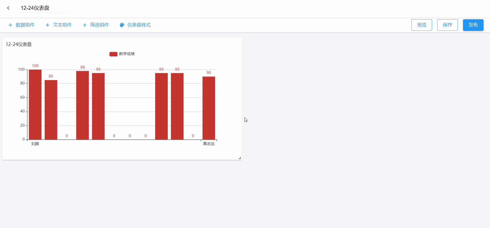
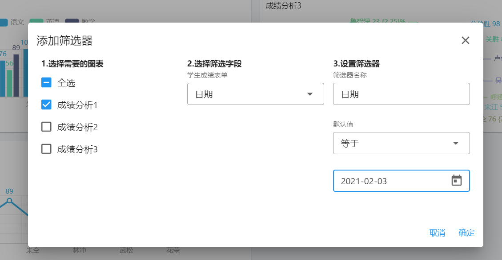
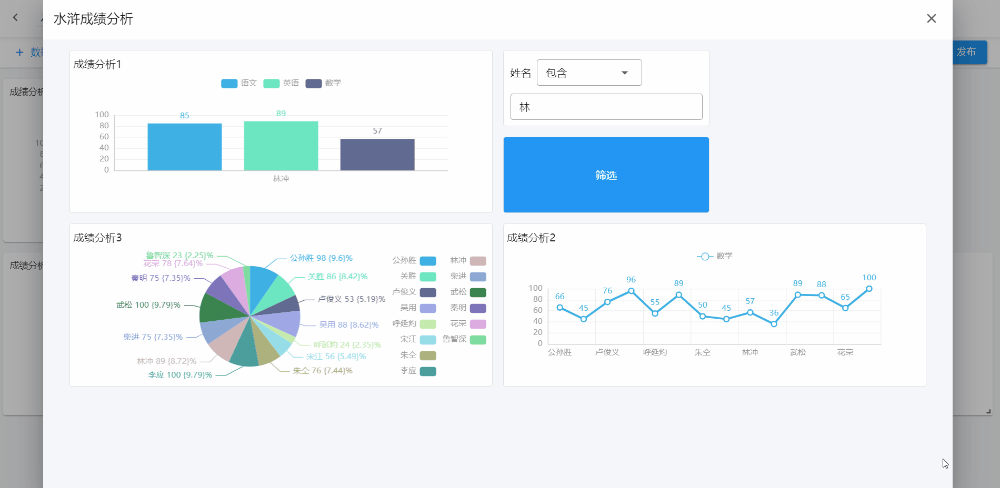

# 筛选组件

仪表盘做好后，可以设置筛选组件或者过滤条件

- [筛选组件](#筛选组件)
- [筛选按钮](筛选按钮)

## 筛选组件

筛选组件是在图表的过滤条件之上进行二次数据过滤的组件。

`选择需要筛选的图表` >> `选择作为筛选项的字段` >> `设置筛选项`

如果筛选字段选择的是日期字段，筛选器的值会对应的切换为日期选择组件

## 筛选按钮

筛选按钮用来在仪表盘预览界面实时触发筛选组件的筛选条件。

添加筛选按钮前首先要添加筛选组件，否则不可添加筛选按钮。

