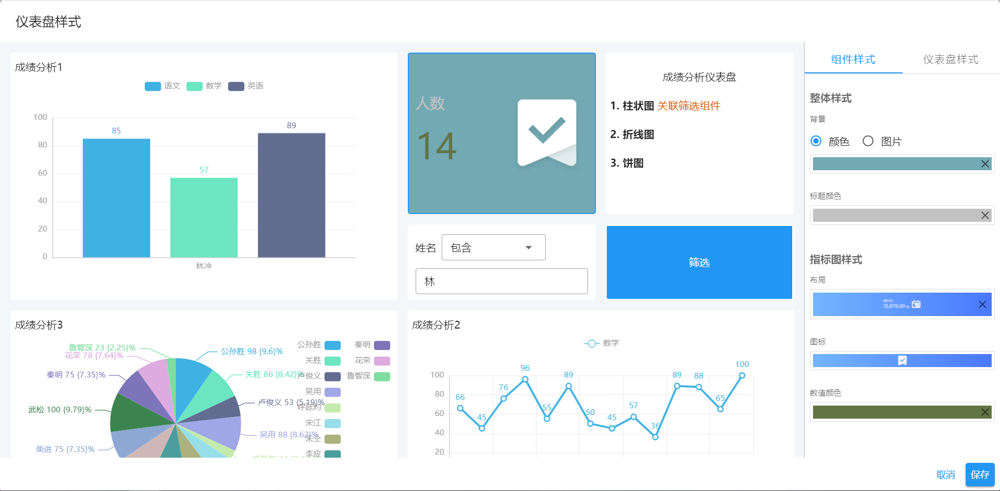
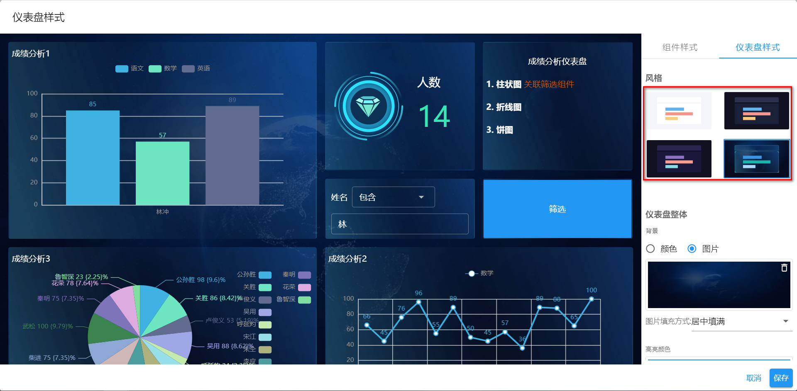
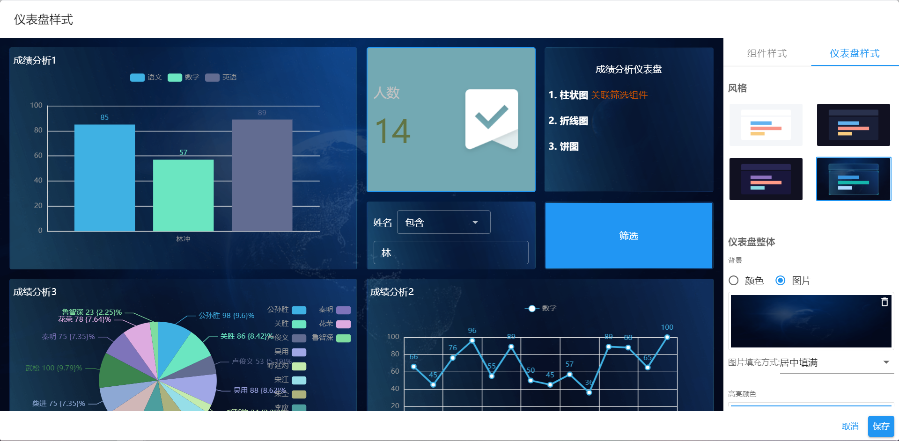

# 仪表盘样式

通过仪表盘样式设置，可以快速完成仪表盘视觉风格的转换。

仪表盘样式分为单个组件样式和整体仪表盘样式两个部分。

## 组件样式

针对单个图表组件的样式配置。可设置选项：背景、标题颜色、配色方案及指标图样式。

- 背景：可选择设置纯背景色或背景图片。
- 标题颜色：图表标题的字体颜色。
- 配色方案：内置图表颜色配色方案，用于不同类型图表的数据对应区域颜色区分。
- 指标图样式
  - 布局： 调整单维度指标图的默认布局
  - 数值颜色：单维度指标图统计数据的字体的颜色

## 仪表盘样式

仪表盘主体风格样式设置。现内置了四种主题风格供选择。

如果同时设置了组件样式和仪表盘样式，以组件样式设置为准。

