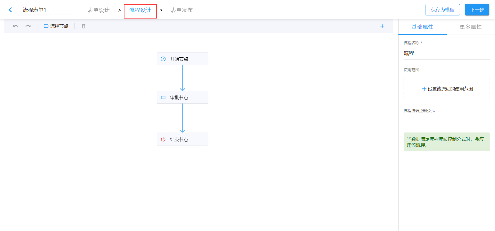
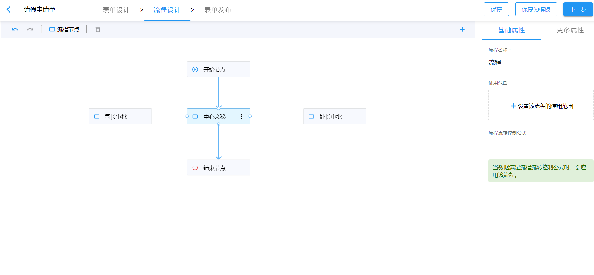

# 流程设计

当我们的表单业务需要多方参与且按照一定规则流转时，就需要用到流程设计。表单设计人员按照自身需求设置流程节点及每个节点的操作权限。一旦数据提交后，就会按照流程设定流转。

## 流程设计入口

在流程表单设计页面，有流程设计页签，直接点击页签，可进入流程设计页面。

## 流程设置

### 设置节点

通过拖拽添加流程节点，选中节点，可修改节点名称。

### 设置路由

将鼠标悬浮至节点上，节点会出现连线锚点，从任一锚点出发，通过鼠标拖动向另一节点画线。

### 设置节点负责人和权限

在选定节点的基础属性里，可以为流程节点设置审批负责人，并且可以设置此节点对表单字段的操作权限。

### 设置节点操作权限

选定节点，在其更多属性中设置关于审批意见及节点操作的权限。

### 设置流转规则

流转规则的设置可以确保流程高效无误的流转；当一个流程节点由多个负责人时，需要确定需要所有负责人审批完提交还是只需要一个负责人审批完提交即可流转流程。

系统默认：任意负责人提交后进入下一节点。

### 多流程表单

可以在流程设计页面，点击右上角的“+”号，添加新的流程，并可以自由设置每个流程的适用范围，以满足多流程表单的需求。

关于流程设置的细节，请继续查看本章节其它文档中的详细描述。
