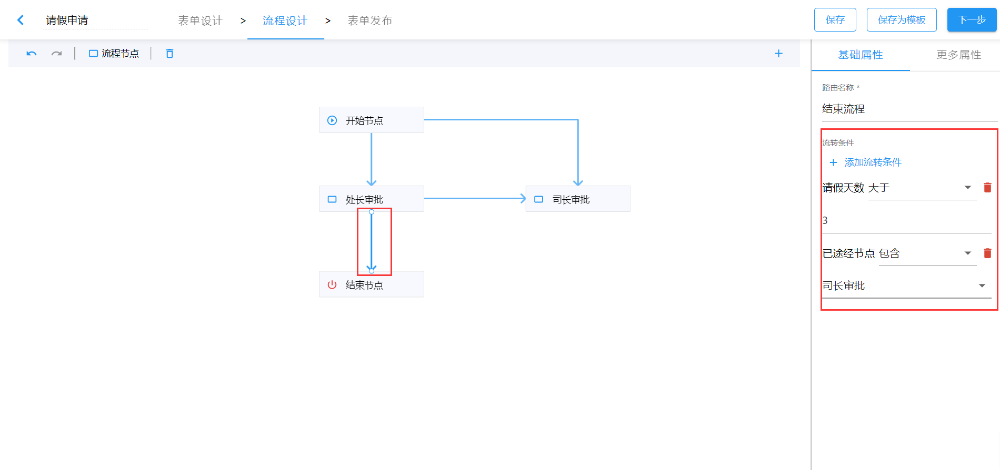

# 流转规则

流转规则主要有两大类：

- 在节点上设置的流转规则
- 在路由上设置的流转条件或控制公式

## 流程节点上的流转规则

在流程节点的`更多属性`面板中，可以设置流转规则，流程流转规则默认为`任意负责人提交后进入下一节点`，即只要有一个负责人提交下个节点就会收到待办信息；我们也可将其调整为`所有负责人提交后进入下一节点`，即必须收到数据的节点负责人全部提交，下个节点方可收到待办数据。


## 流转条件

在流程路由的`基础属性`设置面板中，可以自定义路由流转条件以约束数据流转。



如上图设置，在流程使用过程中，如果请假天数大于 3 天，则必须经过司长审批，才能结束流程。

### 流转条件范围

以下事项可作为控制条件：

- 表单中的所有`表单项`，包括`子表单项`（地址选择组件不支持作为流转条件）
- 填报人
- 填报人单位
- 填报时间
- 流程发起人
- 流程发起人单位
- 流程发送时间
- 已途经节点

### 比较关系

控制条件共有以下比较关系：

- 等于
- 不等于
- 大于
- 大于等于
- 小于
- 小于等于
- 包含
- 不包含
- 等于任意一个
- 不等于任意一个
- 为空
- 不为空
- 日期区间

字段类型不同，支持的比较关系也不同：

- 只有数字组件支持`大于`、`大于等于`、`小于`、`小于等于`比较关系
- 只有单行文本和多行文本支持`包含`、`不包含`比较关系
- 只有日期组件支持`日期区间`比较关系
- 所有流转条件事项都支持`为空`和`不为空`比较关系
- 子表单中的所有子项支持的比较关系同以上几条规则

### 添加流转条件

同一控制条件事项可以被多次添加来作为具有不同比较关系的控制条件，流程流转时当数据满足所有条件时，才可以选择满足条件的路由进入下一节点。

## 流程控制公式

在流程路由的`更多属性`中，可以自定义路由的控制公式，以达到约束流程流转的目的，它与流转条件是并列关系，即如果同时设置了流转条件和控制公式，必须同时满足条件才可以继续流转。

使用流程控制公式实现上述`流转条件`中的场景时，可以是以下公式`请假天数 > 3 && 已途经节点 in ["司长审批"]`。


### 控制条件范围

以下事项可作为控制条件：

- 表单中的所有`表单项`，`子表单项`
- 填报人
- 填报人单位
- 填报时间
- 流程发起人
- 流程发起人单位
- 流程发送时间
- 已途经节点

### 快速用法

控制公式的语法借鉴 JavaScript 表达式语法，形如：

```js
流程发起人 in ["张三", "李四"] && 填报人 like "张%"
```

示例公式的语义是： 流程发起人是 `张三` 或者 `李四`，并且填报人姓张。

### 控制公式语法

控制公式语法在遵循 JavaScript 表达式语法子集的基础上扩展了关系运算符 `in` 和 `like`。

#### 比较关系运算符

支持以下关系运算符：

- `like` - 字符串匹配（字符串包含）
- `in` - 数组包含
- `>`
- `>=`
- `<`
- `<=`
- `==`
- `!=`

#### in 数组包含

```js
value in [1, 2, 3];
```

value 可以是数字、字符串、数组、也可以是对象：

- `value = 1`时，公式返回 `true`
- `value = 4`时，公式返回 `false`
- `value = [1, 7, 8]`时，公式返回 `true`
- `value = [8, 9]`时，公式返回 `false`
- `value = "1"`时，公式返回 `false`
- `value = {selected: 1}`时，公式返回`true`
- `value="1,2,3"`时，公式返回`true`

#### `like` 字符串匹配

```java
userName like "张%"
```

规则如下：

```java
"张三" like "张%"     ====> TRUE
"李张三" like "张%"   ====> FALSE
"李张三" like "%张%"  ====> TRUE
"张三" like "张_"     ====> TRUE
"张三2" like "张_"    ====> FALSE
"张三2" like "张%"    ====> TRUE
```

- `_` 表示匹配一个任意字符
- `%` 表示匹配零个、一个或者多个任意字符

#### 逻辑关系运算符

支持以下关系运算符：

- `&&`、`AND`
- `||`、`OR`
- `!`、`NOT`

例如：

```java
姓名 like "张%" && 年龄 >= 18 && 年龄 != 30
```

#### 使用小括号`(`、`)`定义表达式的优先级

```java
姓名 like "张%" && (年龄 <18 || 年龄 > 60)
```

此控制公式语义为：年龄小于 18 岁 或者大于 60 岁，并且姓张。

除此之外，我们可以使用 ! 和关键字 not 表示逻辑非运算。以下两个控制公式表达语义相同：

```java
填报人 not in ["张三","李四"]

!(填报人 in ["张三","李四"])
```

#### 字面量

支持三种字面量。

`字符串`：

```java
"字符串值"
```

> 注意：必须使用双引号`"`表达字符串字面量。**字符串不支持单引号**。

`数字`：

```java
10
20.1
-10.5
.5
+0.15
```

`数组`：

```java
[1, "2", [3, "4"]]
```

#### 设置表单项作为控制项

我们在使用表单项作为控制项时，可以在公式中使用字段标题或者字段名称作为控制项，在计算公式时会自动从表单中获取字段值。

如：

```JavaScript
用户名 like "张%"

userName like "张%"
```

#### 设置子表单项作为控制项

由于子表单数据结构比较复杂，所以我们在设置子表单项作为控制条件时，需要特别注意以下场景：

场景一： 子表单中任意一条数据的某一项设置控制公式

```java
子表单.年龄 >= 18
```

此控制公式语义为： 子表单中任意一条数据中的年龄`大于等于`18 时，此控制公式就会满足条件。

场景二： 子表单中某一条数据的某一项设置控制公式

```java
子表单[2].年龄 >= 18
```

此控制公式语义为： 子表单中第三条数据中的年龄`大于等于`18 时，此控制公式才会满足条件。
