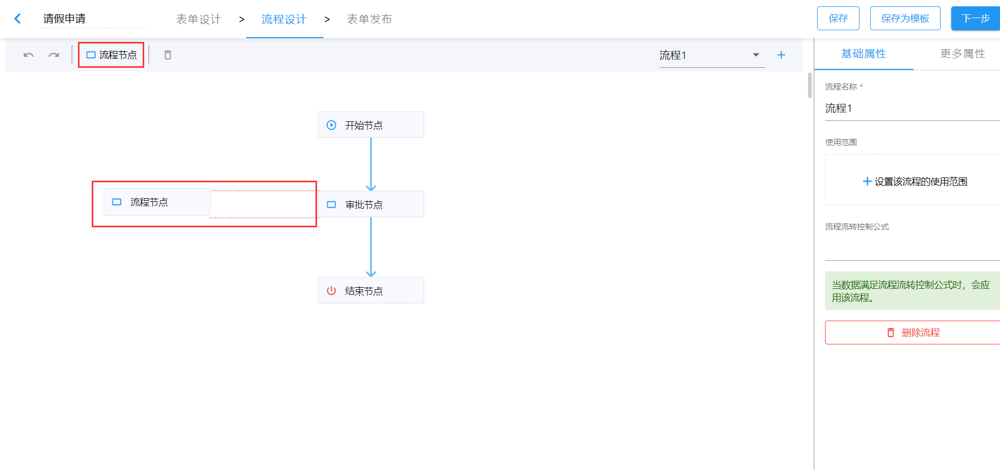
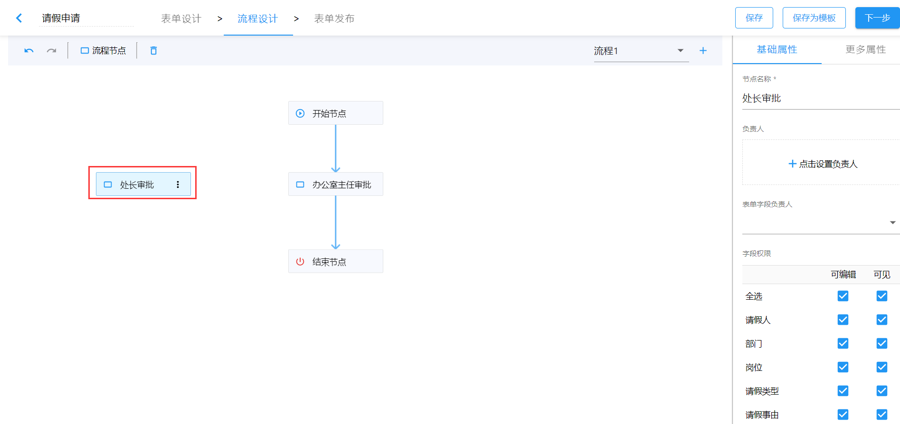
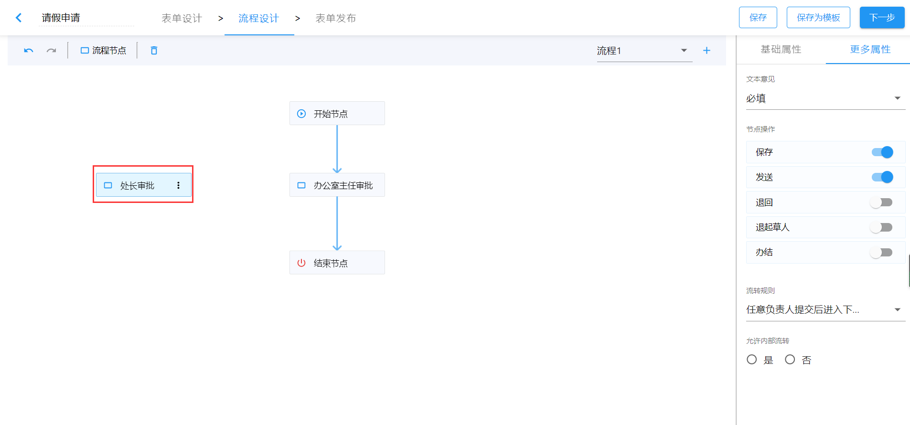
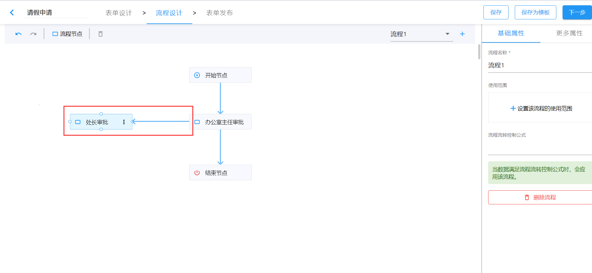
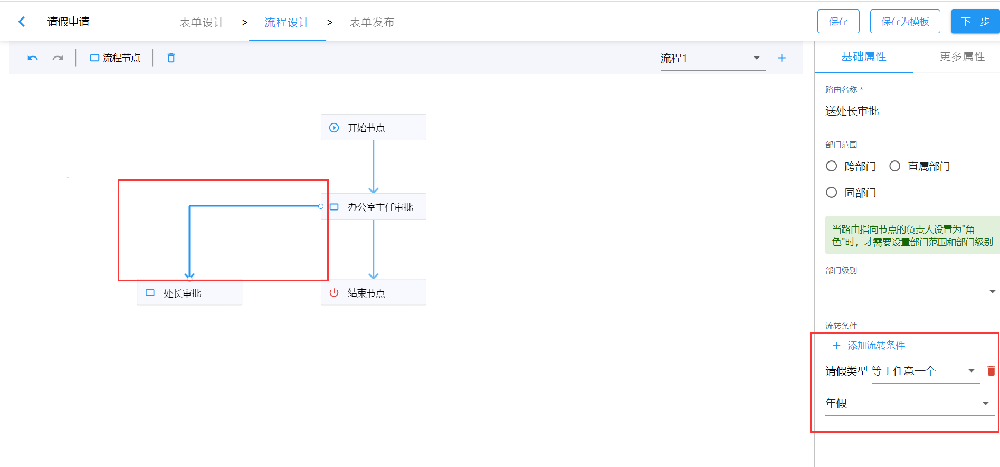

# 新建节点和路由

## 新建节点

打开流程设计，会有一个默认的简易流程图。我们可以在此基础上进行调整，拖拽工具栏中的流程节点到设计区域中，并调整其到合适的位置。在拖拽过程中，当其与已设置的流程节点在水平或垂直方向对齐时，会出现对应的辅助线。

### 设置节点属性

新增流程节点时，节点默认是选中状态，此时可在右侧设置栏设置相关属性，主要包括：

- 节点名称
- 负责人
- 字段权限
- 文本意见
- 节点操作
- 流转规则

## 新增路由

鼠标悬浮至某节点上时，节点四周有空心圆，可以从中拖拽出线条，与其他节点建立连接线，表示流程的进行方向； 如果要删除一个流程关系，只需要拖动线条至空白处，松开鼠标即可； 如果要修改一个流程关系，只需要拖动线条到另一个节点上的空心圆处即可。

### 路由配置

选中流程路由，可以在右侧的设置面板调整其路由名称、流转规则等。若路由流转条件属性设置如下图，在流程流转时，只有请假类型为“年假”时，办公室主任在提交流程时，才会出现“送处长审批”的选项。

