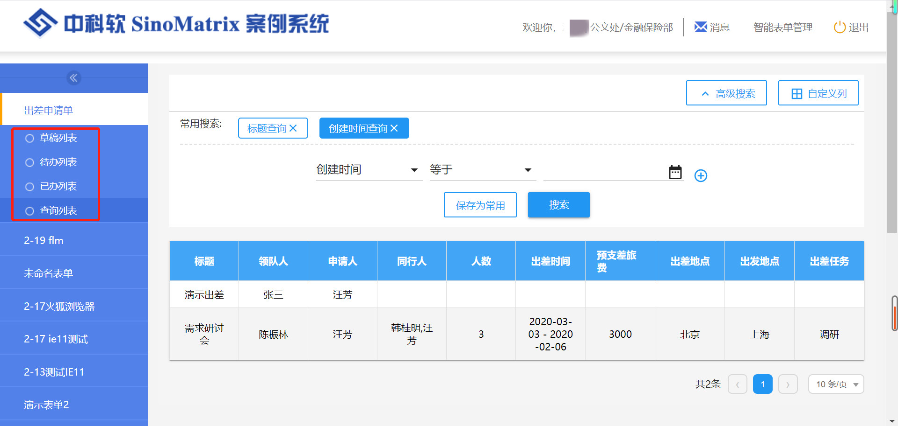
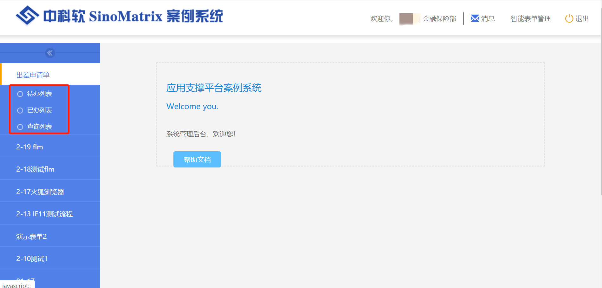
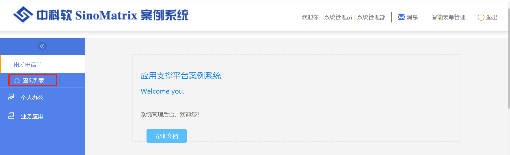
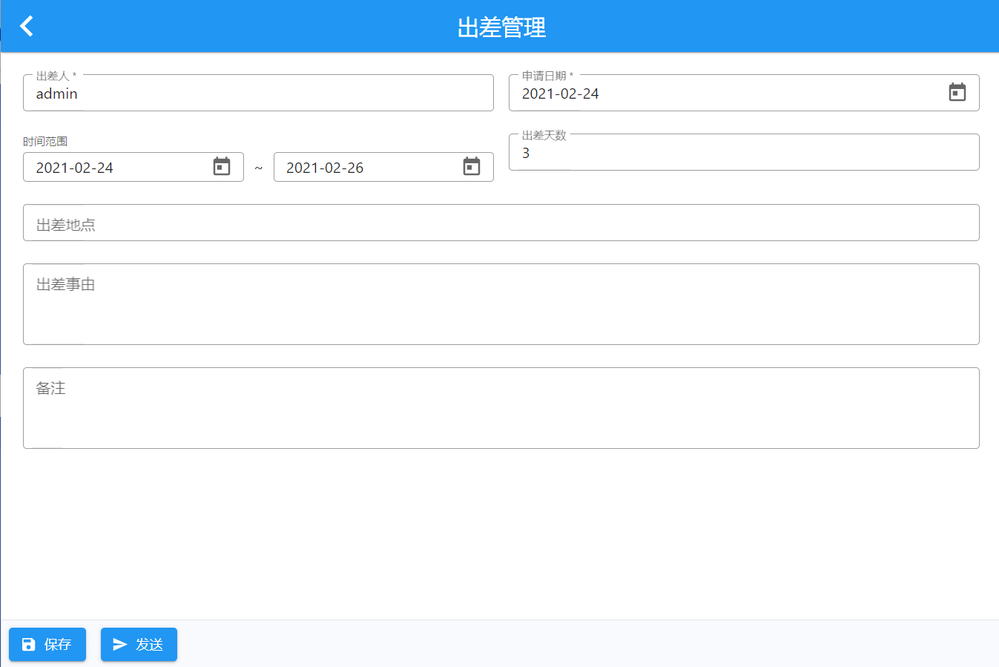
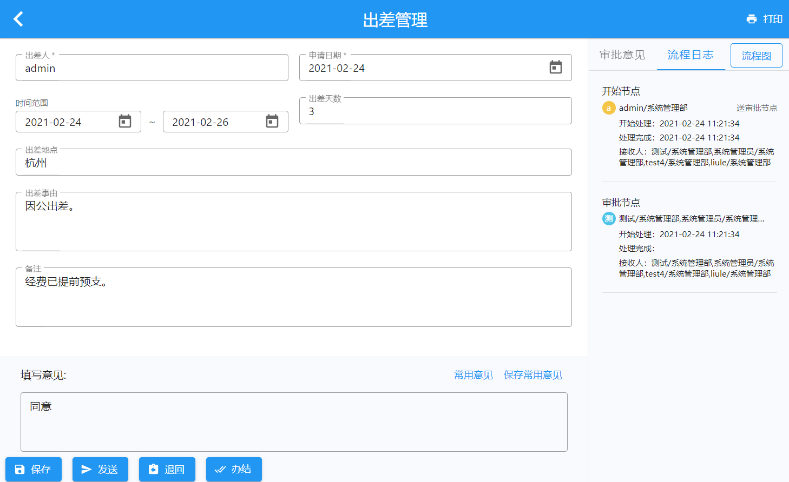
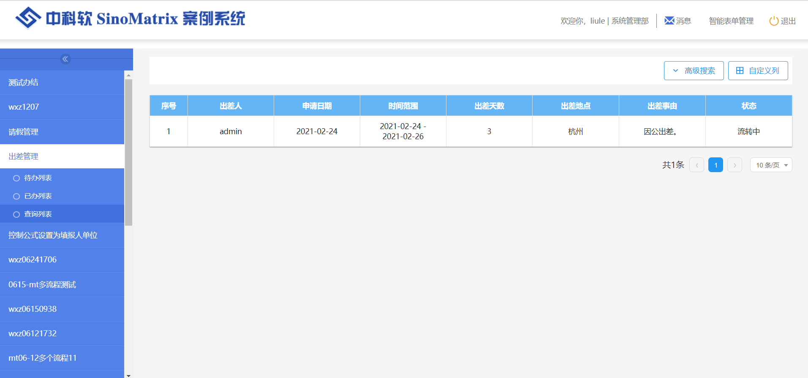
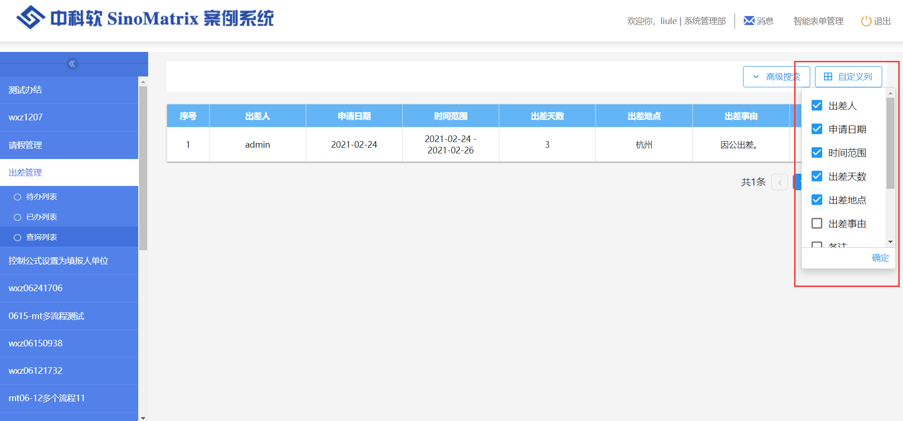
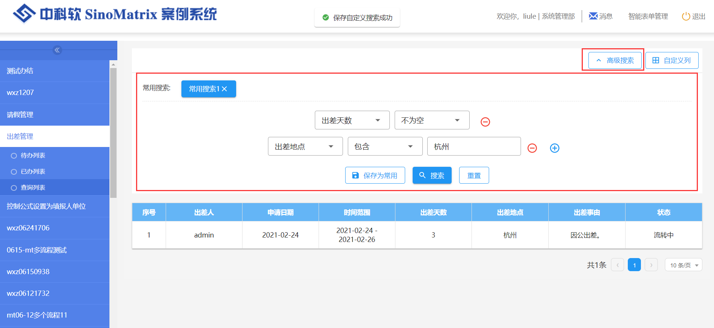

# 流程应用

表单发布完成后，流程进入应用阶段。

## 列表权限

- 起草节点的负责人有草稿、待办、已办和查询列表权限

  

- 除起草节点外的流程节点负责人有待办、已办和查询列表权限

  

- 表单发布时设置的`数据查看人员`只有查询列表权限

  

## 数据填报

起草节点负责人点击草稿页面的`新建`按钮，添加数据。

## 数据查看

数据查看页面，右侧侧边栏显示审批意见、流程日志和流程图方便用户查看流程相关信息。

## 查询列表

### 自定义展示列

用户可自定义查询列表展示的字段项。默认展示表单字段的前 7 项加上`状态`项。

### 高级搜索

可以将常用的搜索项组合后保存为常用搜索，方便数据的筛选。

