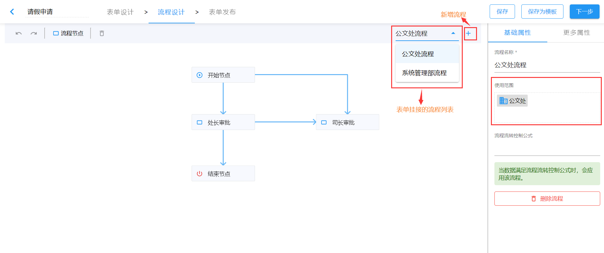

# 流程管理（多流程）

业务表单支持多流程。即同一个表单在不同部门应用时，可以使用不同的流程。

图中的配置，如果此表单在公文处流转，则会使用当前流程；如果是系统管理部使用，则会使用系统管理部的流程配置。

从上图中，我们可以看到表单所挂接的流程列表，同时也可点击`+`号新增流程。选定流程，可以设置流程名称和流程使用范围，以及流程流转控制公式，同时也可进行流程删除。

## 流程流转控制公式

流程流转控制公式的定制规则同[流转规则中的控制公式语法](./circulation-rules.html#控制公式语法)。
