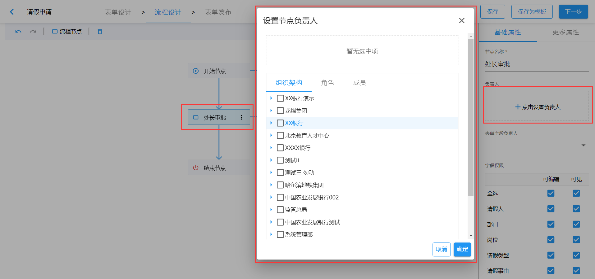
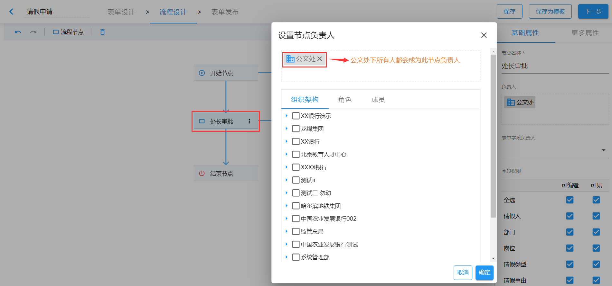
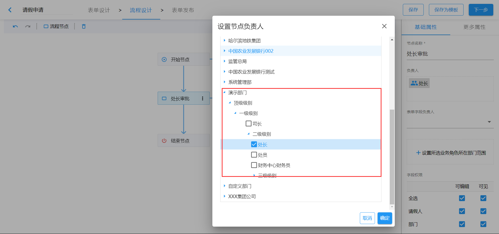
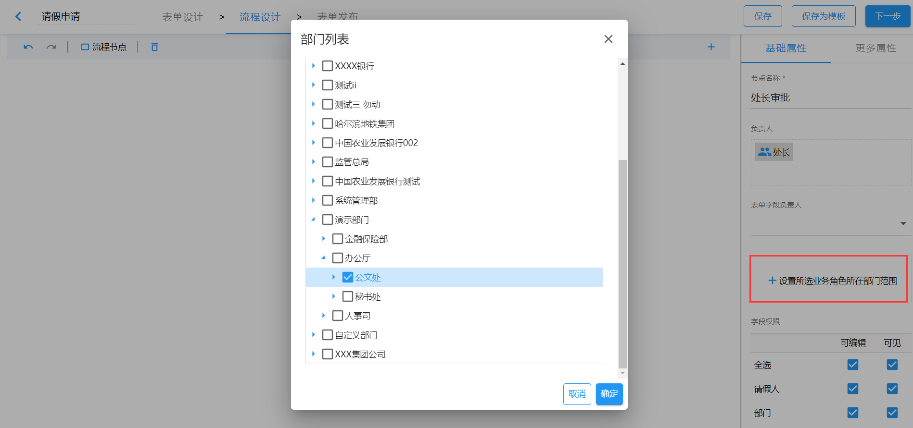
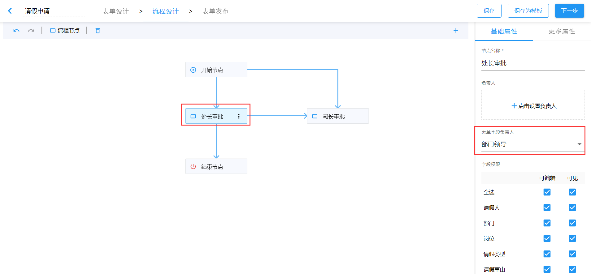

# 设置节点负责人

> 节点负责人为在此节点接收数据并进行处理的人。

`选中节点` ==> `基础属性` ==> `负责人`，点击`设置负责人`按钮，可选范围有`组织架构`、`角色`、`成员`。（**需要注意的是：同一节点负责人只能选择一种类型，不能三种类型混选。**）

## 组织架构

当我们在设置节点负责人选择“组织架构”时，则选中的组织机构下的所有人都会成为此节点负责人。

## 角色

当我们在设置节点负责人选择“角色”时，则拥有此角色的所有人都会成为此节点负责人。

如图中所示，演示部门下所有拥有“处长”角色的人员都会成为此节点的负责人。如果想要严格限制范围，可以在选择“角色”后，设置“业务角色负责人所在部门范围”。

上图配置完成后，“处长审批”节点的负责人范围就会限定为`公文处下拥有处长角色的人员`。

## 成员

同上面`组织架构`和`角色`相同，当我们选定成员以后，被选定的成员都拥有此节点的操作权限。

## 动态设置节点负责人

除了直接设置节点负责人外，我们还可以动态设置节点负责人，即节点负责人来源于表单中的用户选择。

如图中设置，表单中填写的部门领导会成为此节点的负责人。
