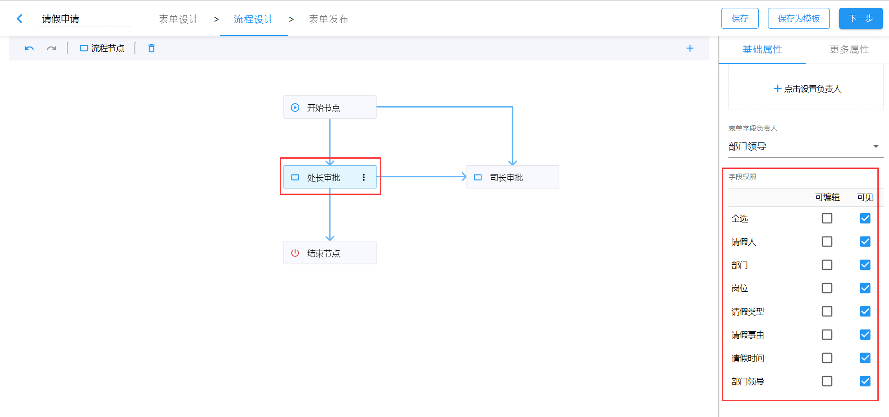
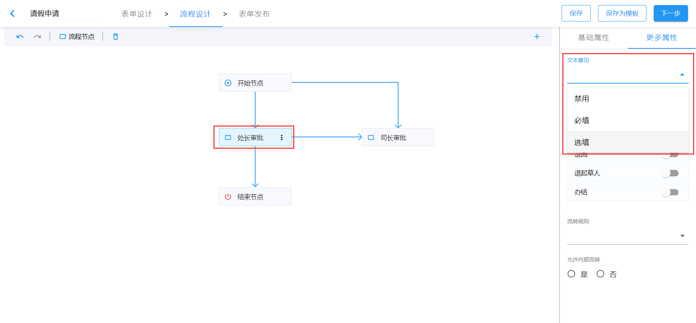

# 节点操作权限

节点操作权限主要包括两部分，`表单字段的操作权限`和`表单流转的操作权限`。

## 表单字段的操作权限

在节点的`基础属性`面板中，我们可以看到表单的`字段权限`，默认情况下，所有表单字段可见且可编辑。如果我们需要调整某些字段的可见性或者可编辑性，直接取消对应的勾选即可。

如上图配置，则数据流转至`处长审批`节点时，表单只读。

## 表单流转的操作权限

在节点的`更多属性`配置中，我们可以配置表单流转时此节点的操作权限，主要包括`意见`和`节点操作`权限。

### 审批意见

设置审批意见是`禁用`、`选填`或者`必填`。当设置为`禁用`时，数据流转至此节点，表单中没有`审批意见`的填写区域；如果设置为`选填`时，数据流转至此节点，表单中有`审批意见`的填写区域，但不填写也可以继续流转；如果设置为`必填`时，数据流转至此节点，表单中有`审批意见`的填写区域，且必须填写意见数据才能继续正常流转。

### 节点操作

节点操作主要包括`保存`、`发送`、`退回`、`退起草人`以及`办结`。默认情况下每个节点都有`保存`、`发送`和`撤回`权限。当数据从此节点流转到下一节点后，只要下个节点负责人未打开该待办数据，则此节点一直有`撤回`权限。

