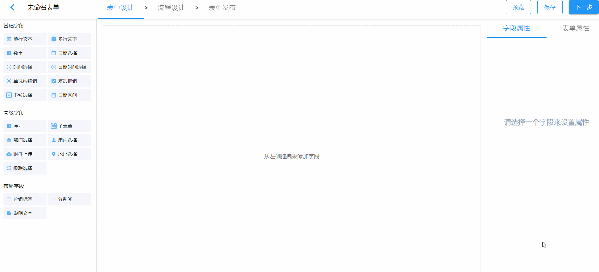
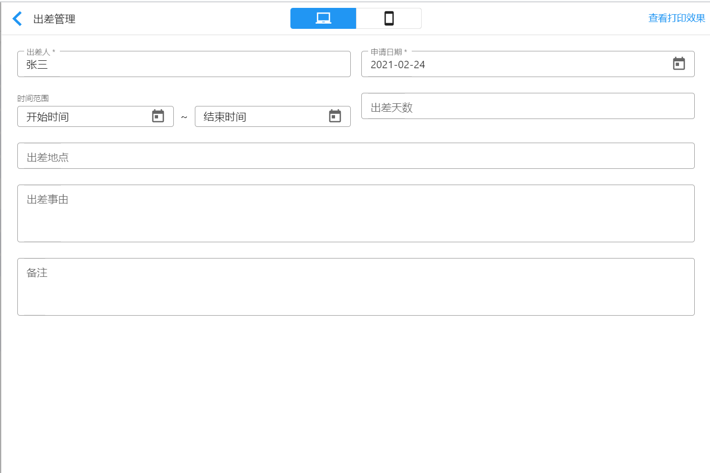

# 新建表单

## 新建表单入口

新建表单主要有两个入口：

- 在表单页签直接新建表单
- 在应用页签，先新建应用，再在应用下新建表单

## 添加表单字段

在表单设计器中我们可以通过拖拽或者单击的方式新增表单字段。

## 设置字段属性

添加完表单项之后，我们可以根据实际需要设置字段属性，如字段标题、字段描述，字段布局等，设置时，只需点击选中字段，就能在右侧的设置面板中看到改字段的所有属性。

## 设置表单属性

表单属性主要有两类：

- 用于从整体控制表单风格，如输入框模式、标签排列方式、标签布局方式、密集模式
- 用于打印输出，如打印输出模板

## 表单保存

设计表单的过程中为避免数据丢失，要记得及时保存表单设置。

## 表单预览

遵循“所见即所得”原则，在设计过程中，可以实时预览表单。

默认表单配置下的预览：

填充模式下的表单预览：

