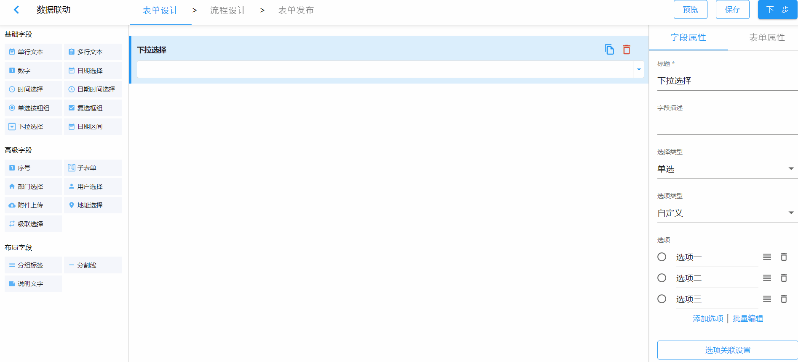
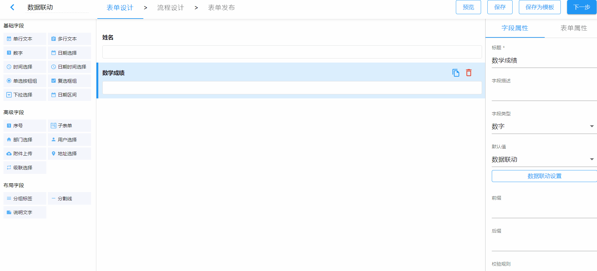
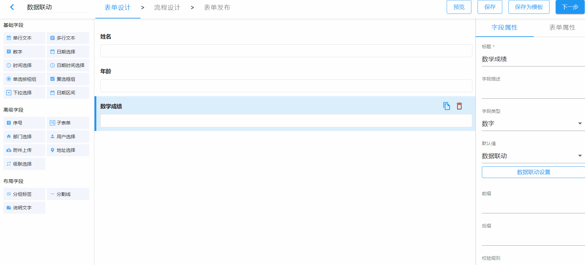
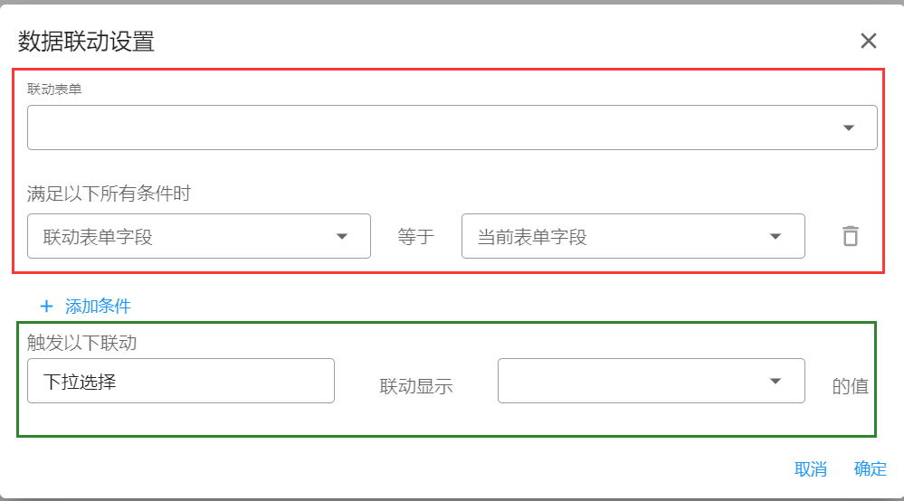
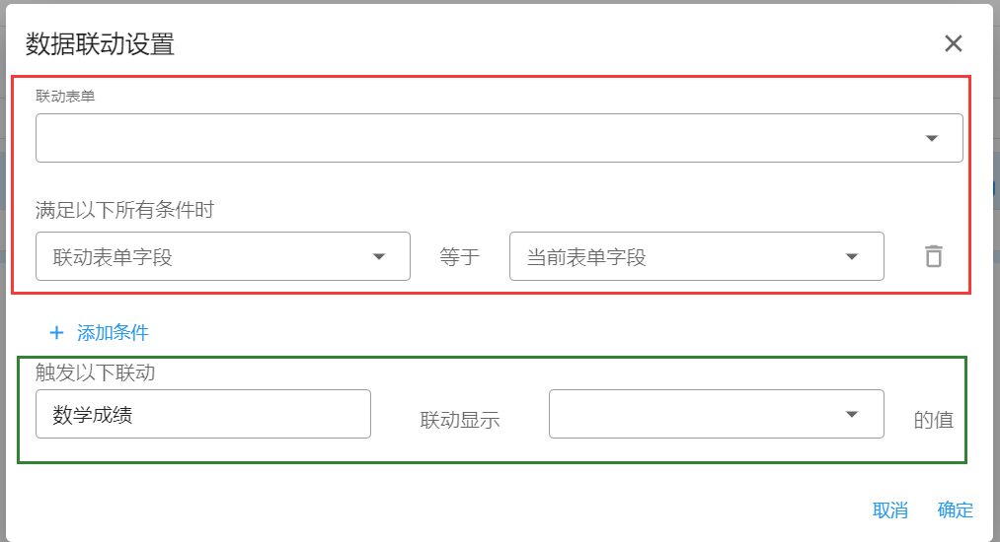

# 数据联动

数据联动在应用下的表单中使用，可以用来对另一张表单中已经录入的数据进行直接或者有条件地调用。

## 关联其他表单选项

关联其他表单选项在`下拉选择`中使用，将选项类型设置为`关联其他表单项`并设置相关的表单及表单项，使用时，下拉选择的选项直接调用关联表单的表单项已经录入的数据。

## 一级联动

数据联动即有条件的调用同一应用下其他表单数据。使用场景主要有两种：`下拉选择的选项`和`单行文本`、`多行文本`、`数字`、`日期选择`、`时间选择`、`日期时间选择`、`部门选择`、`用户选择`的默认值。

一级联动即只有一级关联关系，字段即可根据某个特定条件直接调用另一表单的某个字段项的值。

上图场景为：当输入的姓名与“12-16 流程表单 1”中的姓名匹配时，数学成绩将直接调用“12-16 流程表单 1”与之匹配的数据中的数学成绩，需要注意的是如果匹配到多条数据，默认调用第一条数据中的值。

## 多条件联动

在上述场景中再增加一个匹配条件，即当`姓名`和`年龄`分别与“12-16 流程表单 1”中的姓名和年龄匹配时，数学成绩才能直接调用“12-16 流程表单 1”中对应的数学成绩的值。

## 数据联动设置说明

### 用在下拉选择中

1. 图中红框中“等于”左侧可选项为联动表单的所有字段（布局字段、附件、日期区间、子表单除外）；一旦左侧选定，右侧当前表单字段将根据选定字段的类型进行过滤，具体规则如下：
   - 左侧选定字段类型为单行文本、多行文本、下拉选择、单选按钮组时，右侧可选字段不进行过滤
   - 除上述四个外，左侧选定的字段类型是什么，右侧就将根据此类型过滤出可选字段。比如左侧选定字段类型为“人员选择”，那么右侧可选字段则为当前表单中的所有“用户选择”类型的字段，如果当前表单中没有此类型的字段，则无法以此字段作为条件。
2. 图中绿框中，右侧可选项为联动表单的所有字段（布局字段、附件、日期区间、子表单除外）

### 用在默认值中

1. 图中红框中的规则同上面的第一条
2. 绿框中，右侧可选字段会根据当前字段类型来过滤，具体规则如下：
   - 如果当前字段（左侧）为“单行文本”、“多行文本”,则右侧可选项为联动表单中除布局字段、附件、日期区间、子表单之外的所有字段
   - 如果当前字段（左侧）为“数字输入框”、“日期选择”、“日期时间选择”、“部门选择”，“用户选择”时，右侧可选项则为联动表单中能够跟当前字段类型一致的字段集合
