# 公式

如果某个字段设置默认值为公式并编辑公式之后，在表单填写时，该字段可以根据公式自动计算出来。

因为少去人工计算和输入的步骤，避免了表单值错误的情况。

- [公式规则](#公式规则)
- [逻辑函数](#逻辑函数)
- [文本函数](#文本函数)
- [数学函数](#数学函数)
- [日期函数](#日期函数)

## 公式规则

目前支持编辑公式的字段有：「单行文本」、「多行文本」和「数字」

进入表单设计页面，选中可编辑公式的字段，在字段属性中找到默认值，把默认值的类型改成“公式”，然后在其下方会出现“编辑公式”按钮，点击即可编辑公式。

### 公式组成

公式通常由字段、函数、运算符和标点符号组成。

需要注意的是，如果需要在公式中插入字段，应在公式编辑窗口左下角的字段列表中点击该字段，而不是手动输入字段名称。

因为所有的字段，实际上都有一个内置的 ID，而所能看见的字段名称，也仅仅是一个名称，所以当公式需要将字段值作为变量的时候，手动输入或复制粘贴都是无效的，因为字段名可以重复。

### 公式注意事项

- 公式内所有出现的符号，都需要在英文状态下输入。

- 公式中需要用到的字段要从下方可用变量中选择。

- 公式中，除了支持基本的运算操作符+、-、\*、/，还支持比较操作符>、==、<、!=等。

  <table>
    <thead>
      <th>加</th>
      <th>减</th>
      <th>乘</th>
      <th>除</th>
      <th>大于</th>
      <th>小于</th>
      <th>等于</th>
      <th>不等于</th>
      <th>大于等于</th>
      <th>小于等于</th>
    </thead>
    <tr>
      <td>+</td>
      <td>-</td>
      <td>*</td>
      <td>/</td>
      <td>&gt;</td>
      <td>&lt;</td>
      <td>==</td>
      <td>!=</td>
      <td>&lt;=</td>
      <td>&gt;=</td>
    </tr>
  </table>

- 函数大写。推荐直接从下方函数中选择。

- 数据类型匹配。

  编写公式时，要注意数据类型的问题：

  1. 注意函数参数的数据类型。

     要按照函数的要求，保证参数的数据类型正确。否则可能会出现公式计算错误或计算失败的问题。

  2. 注意公式的返回值的数据类型。

     不同的字段对公式的返回值的数据类型有不同的要求，不符合要求则可能无法获得正确的结果。

     <table>
      <thead>
        <th>字段</th>
        <th>对公式返回值的数据类型要求</th>
      </thead>
      <tr>
        <td>单行文本</td>
        <td>文本、数字、日期等</td>
      </tr>
      <tr>
        <td>多行文本</td>
        <td>文本、数字、日期等</td>
      </tr>
      <tr>
        <td>数字</td>
        <td>只能是数字</td>
      </tr>
     </table>

## 逻辑函数

### AND

AND(逻辑表达式 1,逻辑表达式 2,...)

如果所有参数都为真，AND 函数返回布尔值 true，否则返回布尔值 false。

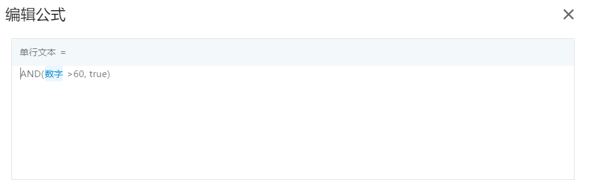

### IF

IF(逻辑表达式,为 true 时返回的值,为 false 时返回的值)

IF 函数判断一个条件能否满足；如果满足返回一个值，如果不满足则返回另外一个值。

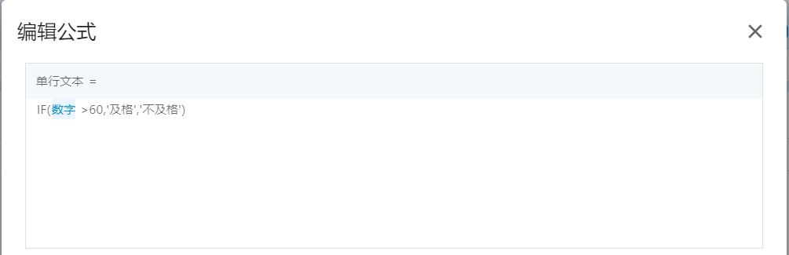

### NOT

NOT(逻辑表达式)

NOT 函数返回与指定表达式相反的布尔值。

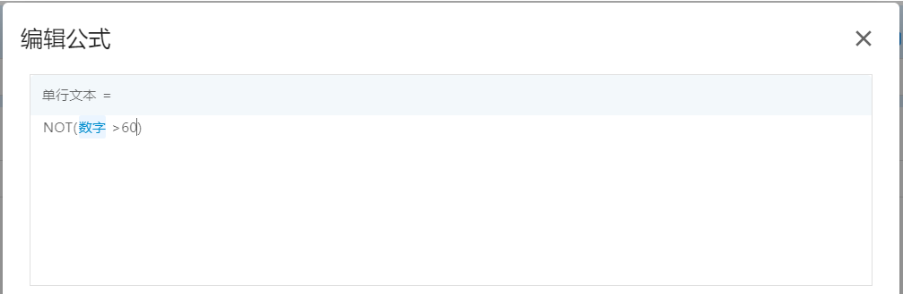

### OR

OR(逻辑表达式 1,逻辑表达式 2,...)

如果任意参数为真，OR 函数返回布尔值 true；如果所有参数为假，返回布尔值 false。

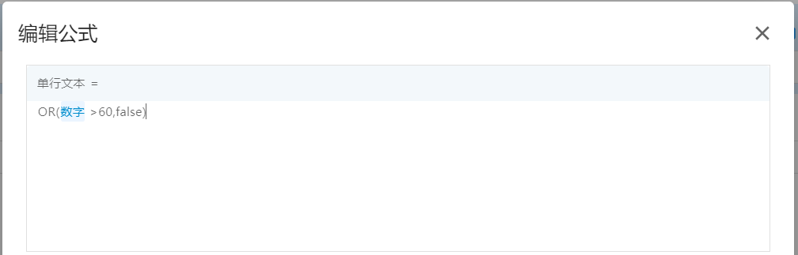

## 文本函数

### CONCATENATE

CONCATENATE(文本 1,文本 2,...)

CONCATENATE 函数可以将多个文本合并成一个文本。

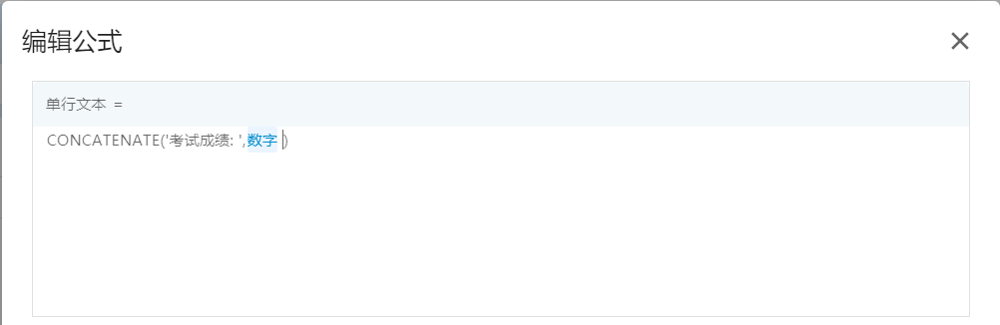

### LOWER

LOWER(文本)

LOWER 函数可以将一个文本中的所有大写字母转换为小写字母。

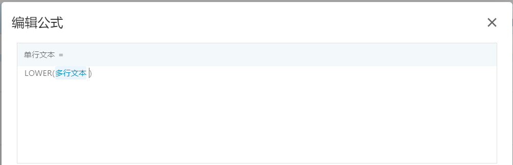

### REPLACE

REPLACE(文本,开始位置,替换长度,新文本)

REPLACE 函数可以根据指定的字符数，将部分文本替换为不同的文本。

### SPLIT

SPLIT(文本,分隔符\_文本)

SPLIT 函数可以将文本按指定分割符分割成数组。

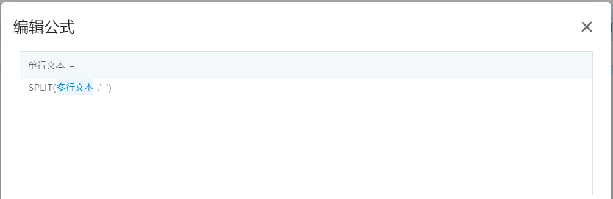

### TRIM

TRIM(文本)

TRIM 函数可以删除文本首尾的空格。

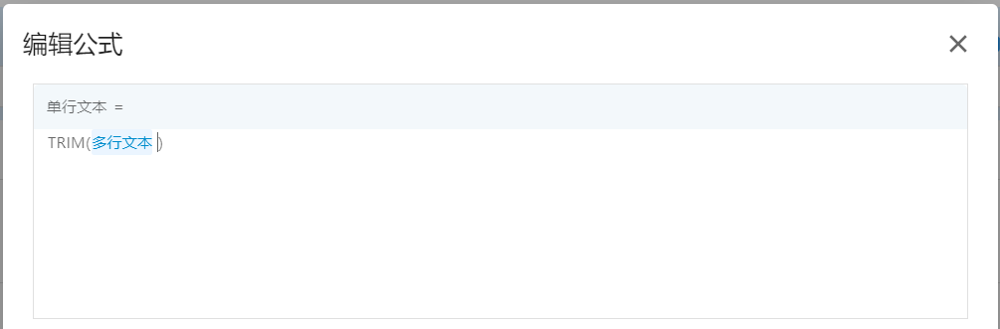

### UPPER

UPPER(文本)

UPPER 函数可以将一个文本中的所有小写字母转换为大写字母。

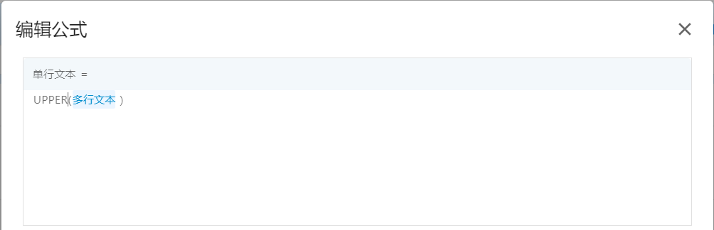

## 数学函数

### ABS

ABS(数字)

ABS 函数可以获取一个数的绝对值。

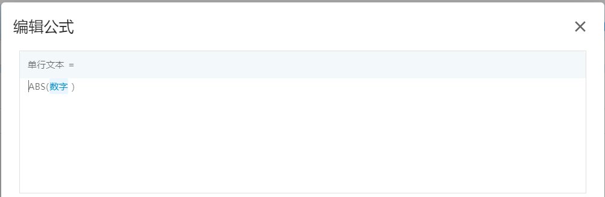

### AVERAGE

AVERAGE(数字 1,数字 2,...)

AVERAGE 函数可以获取一组数值的算术平均值。

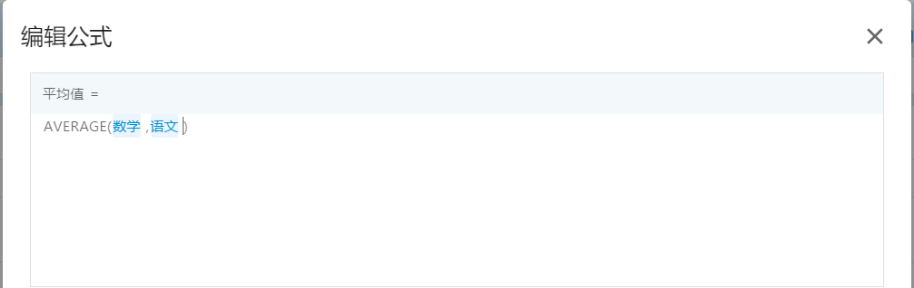

### MAX

MAX(数字 1,数字 2,...)

MAX 函数可以获取一组数值的最大值。

### MIN

MIN(数字 1,数字 2,...)

MIN 函数可以获取一组数值的最小值。

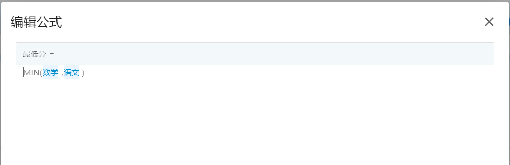

### PRODUCT

PRODUCT(数字 1,数字 2,...)

PRODUCT 函数可以获取一组数值的乘积。

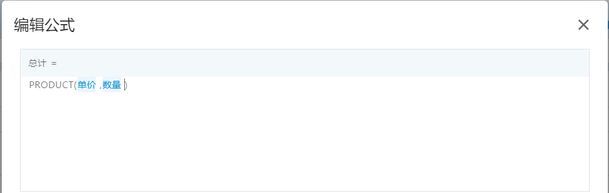

### SUM

SUM(数字 1,数字 2,...)

SUM 函数可以获取一组数值的总和。

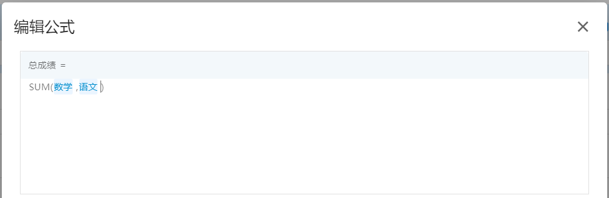

## 日期函数

### DATEDIF

DATEDIF(开始时间,结束时间,[单位])，单位可以是 "y" 、"M"、"d"、"h"、"m"、"s"

DATEDIF 函数可以计算两个日期时间相差的年数、月数、天数、小时数、分钟数、秒数。

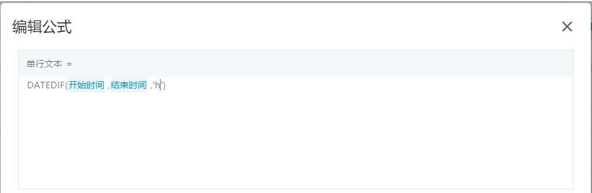

### DAYS

DAYS(结束日期,开始日期)

DAYS 函数可以返回两个日期之间相差的天数。

