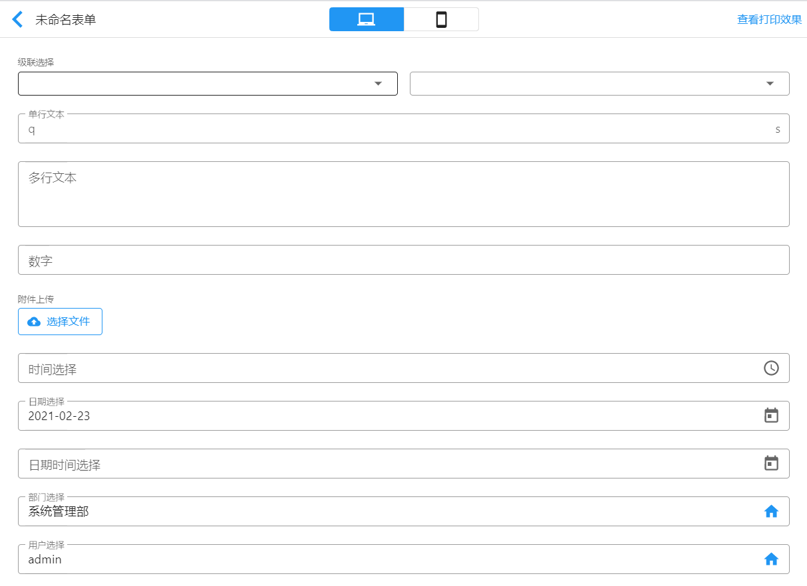
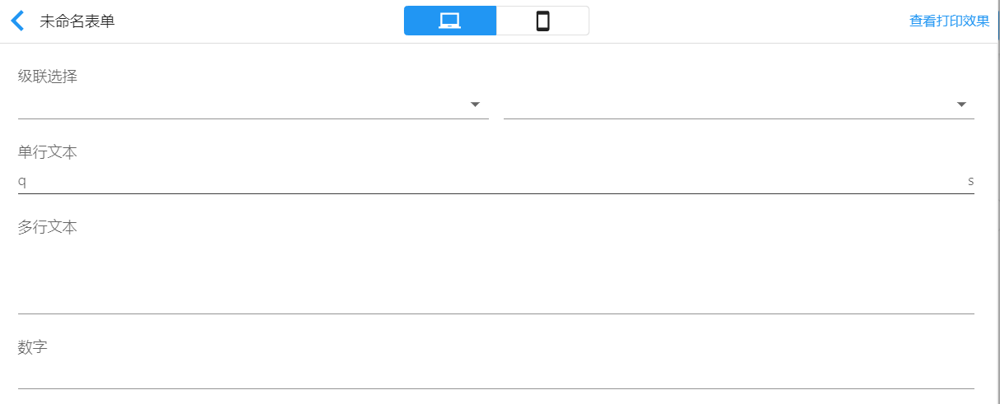
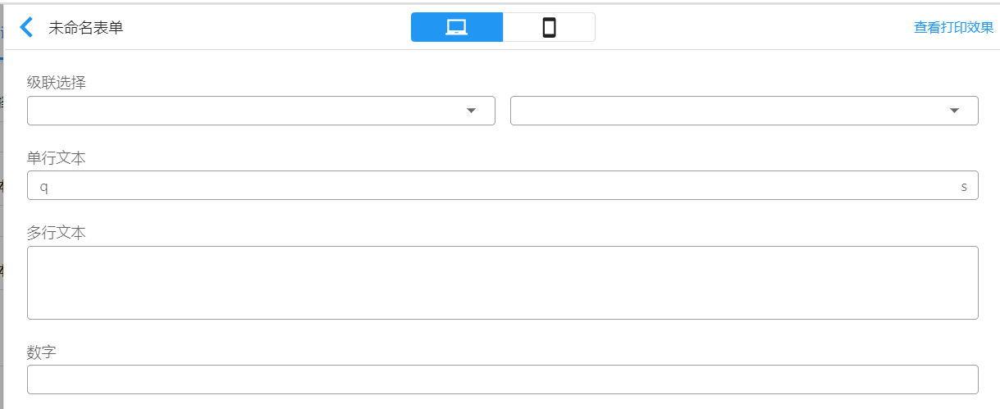
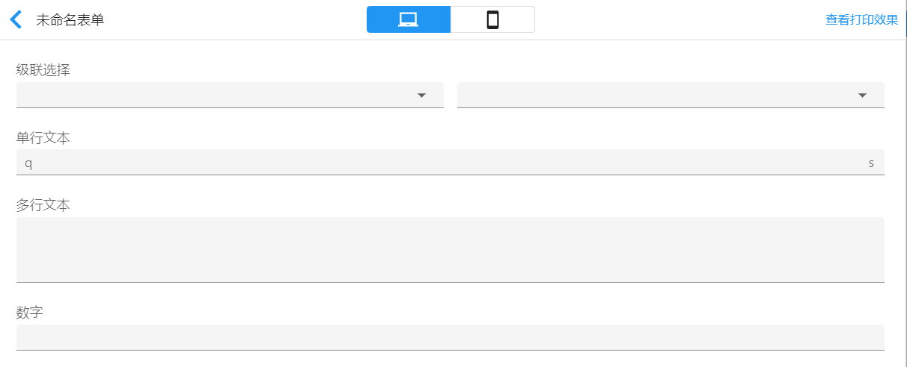
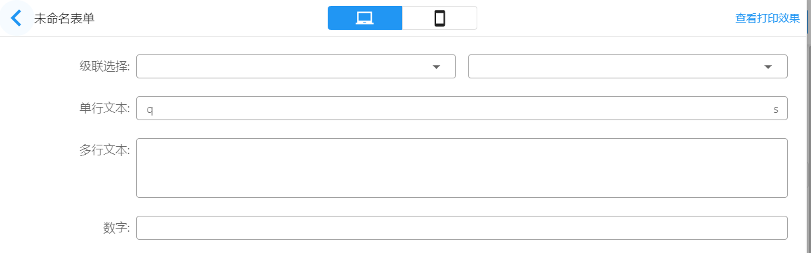
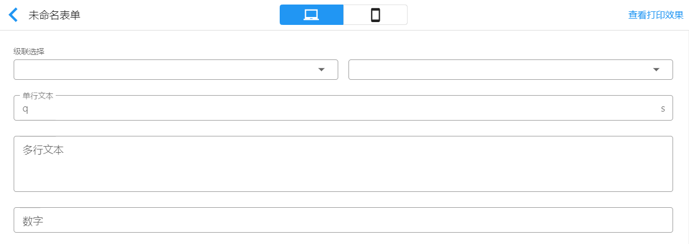
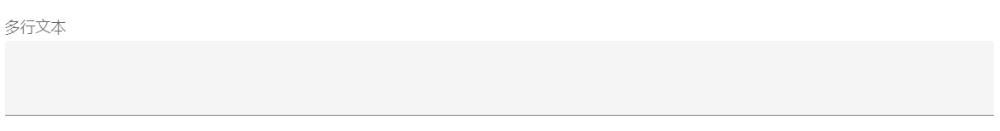
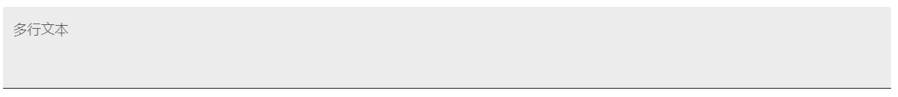
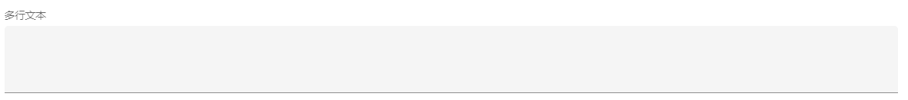

# 表单布局

表单设计时，在表单属性中通过`输入框模式`、`标签排列方式`、`标签布局方式`的组合设置，可以自定义表单的布局方式。

表单布局默认为`边框模式`+`垂直排列`+`浮动布局`的组合。

显示效果： 

## 输入框模式

- 标准模式
- 边框模式
- 填充模式

若标签排列方式为`垂直排列`、标签布局方式为`标准模式`，不同的输入框模式表单布局效果如下：

**输入框模式**

**边框模式**

**填充模式**

##  标签排列方式

- 水平排列
- 垂直排列

若输入框模式为`边框模式`，设置不同的标签排列方式，表单布局效果如下：

**水平排列**

**垂直排列**

## 标签布局方式

- 浮动
- 收缩

标签排列方式为`水平排列`时，不支持标签布局方式设置。若输入框模式为`填充模式`、标签排列方式为`垂直排列`，不同的标签布局方式表单布局效果如下：

**标准**

**浮动**

**收缩**

## 密集模式

用来控制每个表单字段是否以密集模式显示。默认为`是`。

