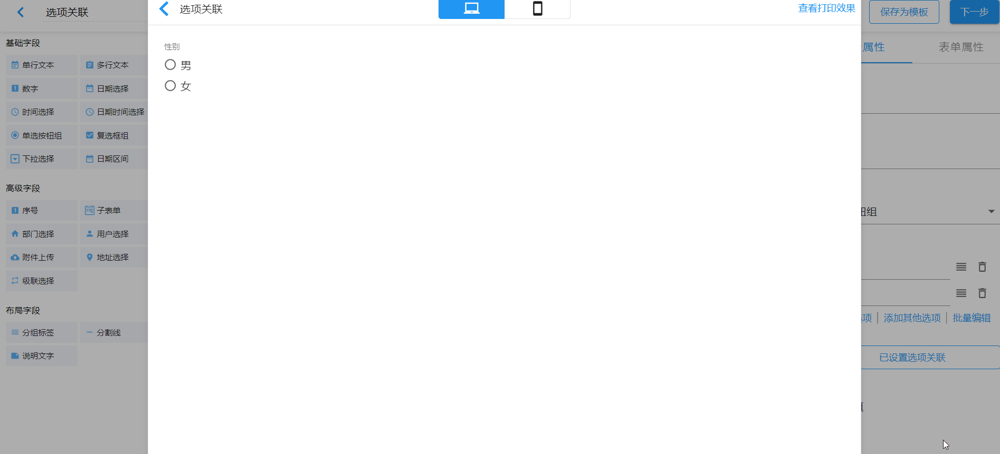
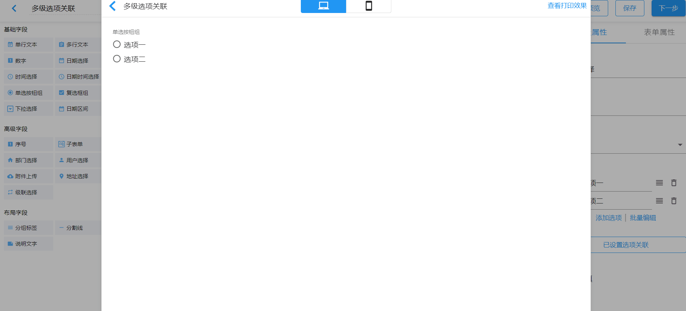

# 选项关联

选项关联即选择某个选项时，联动出相应的字段；否则，该相应字段隐藏。此属性在单选按钮组和单选模式下的下拉选择中使用。

假定如下场景：

一份调查问卷，根据不同性别设置不同问题。男生需要填写`男生信息`和`自我介绍`；女生需要填写`女生信息`和`自我介绍`。我们可以通过选项关联实现。

实际应用效果如下：

即如果什么都不选的情况下，所有被关联的字段都会隐藏；当性别选择`男`时，与之关联的`男生信息`和`自我介绍`将会显示；同理当性别选择`女`时，与之关联的`女生信息`和`自我介绍`将会显示。

## 多级选项关联

选项关联支持多级关联。

使用下面配置满足上述需求：

应用效果：

