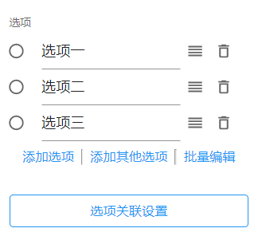
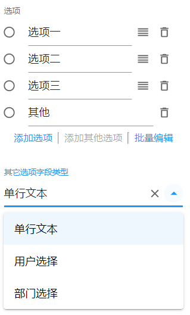

# 单选按钮组

## 选项

单选按钮组字段默认会生成三个选项。用户可以对某个选项进行修改、添加、删除、排序等操作。

### 添加选项

添加一个默认选项名称为`选项`的新选项。

### 添加其他选项

添加一个支持用户自主输入或选择选项值的其他选项。

其他选项的字段类型支持以下几种：

- 单行文本

- 用户选择

- 部门选择

  

当其他选项字段类型为「用户选择」和「部门选择」时，支持设置用户或部门的范围

