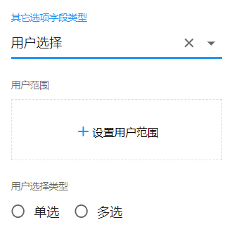
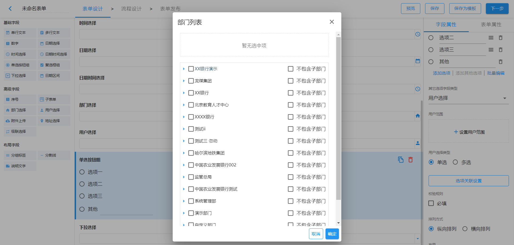
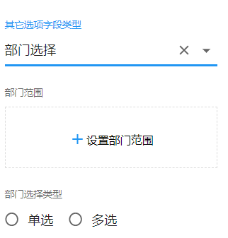
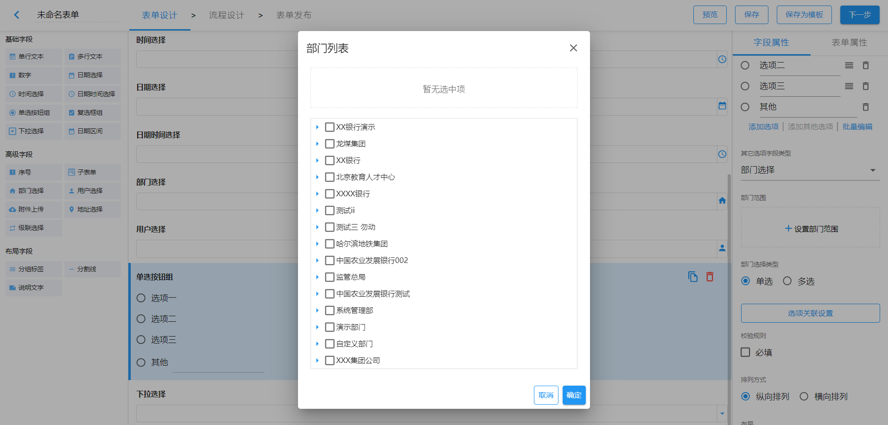
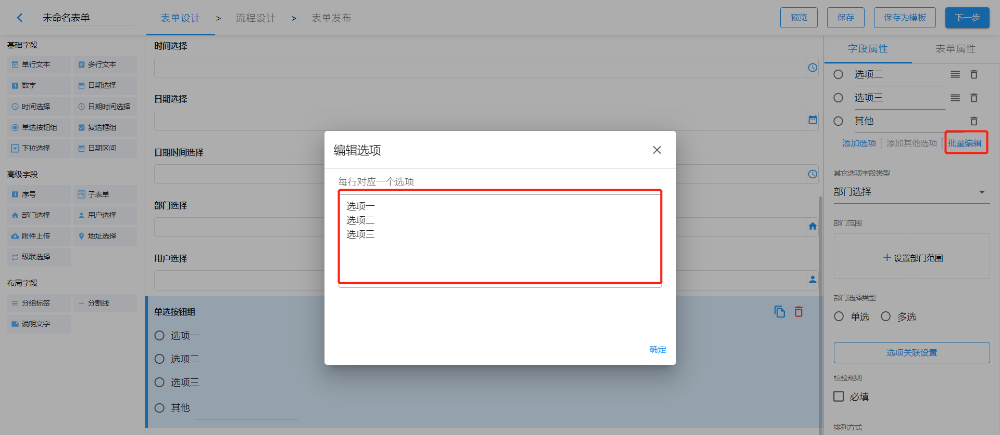
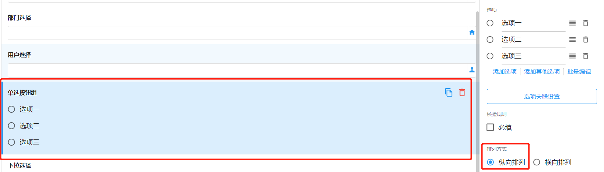
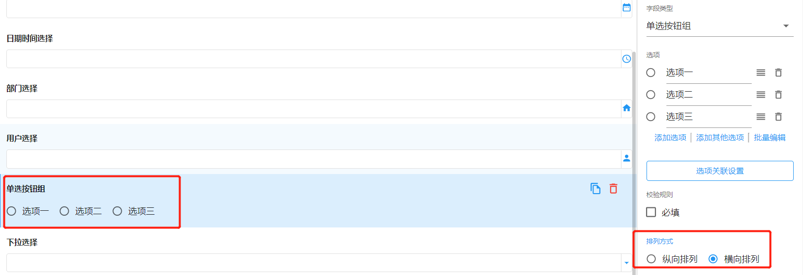

# 单选按钮组

## 选项

单选按钮组字段默认会生成三个选项。用户可以对某个选项进行修改、添加、删除、排序等操作。

### 添加选项

添加一个默认选项名称为`选项`的新选项。

### 选中选项

若选中选项左侧的单选按钮或复选框，则下拉框字段的默认值为选中选项的值。

### 删除选项

点击选项右侧的删除图标，删除当前选项。

### 选项排序

按住某个选项右侧的排序图标，拖动当前选项和已有选项排序。

### 添加其他选项

添加一个支持用户自主输入或选择选项值的其他选项。

其他选项的字段类型支持以下几种：

- 单行文本

- 用户选择

  
  
  当其他选项字段类型为「用户选择」时，支持设置用户范围和用户选择类型。
  
  - 用户范围
  
    用户范围的设置限制了其他选项的用户选择字段渲染后，只能从设置为用户范围的部门下选择用户。若不设置用户范围，其他选项的用户选择字段渲染后可以选择整个组织架构下的任何人。
  
    **特别说明**
  
    若设置用户范围时，选中某个部门后，不选中`不包含子部门`，其他选项的用户选择字段渲染时会显示选中部门下的所有子部门及子部门下的用户。选中某个部门后，同时选中`不包含子部门`，其他选项的用户选择字段渲染时只会显示当前选中部门下的用户。
  
    
  
  - 用户选择类型
  
    用户选择类型设置为单选，其他选项的用户选择字段渲染后，用户树显示为单选。否则为多选。

- 部门选择

  

  当其他选项字段类型为「部门选择」时，支持设置部门范围和部门选择类型。

  - 部门范围

    部门范围的设置限制了其他选项的部门选择字段渲染后，只能选择设置为部门范围的部门。若不设置部门范围，其他选项的部门选择字段渲染后可以选择整个组织架构下的任何部门。

    

  - 部门选择类型

    部门选择类型设置为单选，其他选项的部门选择字段渲染后，部门树显示为单选。否则为多选。

### 批量编辑

批量编辑支持同时编辑除`其他选项`外的所有选项值。

## 排列方式

单选按钮组的选项默认为纵向排列，支持横向排列：

- 纵向排列

  

- 横向排列

  