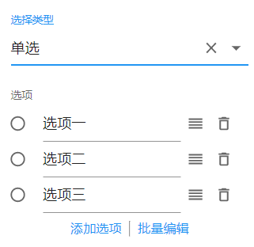
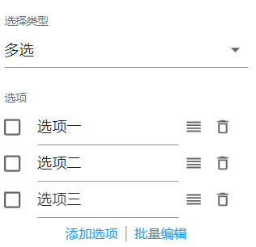

# 下拉选择

## 选择类型

下拉选择支持单选或多选。

## 选项

下拉选择字段默认会生成三个选项。用户可以对某个选项进行修改、添加、删除、排序等操作。

当下拉选择字段选择类型为单选时，只能设置某个选项为下拉选择字段的默认值。选项显示如下：

当下拉选择字段选择类型为单选时，可以同时设置多个选项为下拉选择字段的默认值。选项显示如下：

### 添加选项

添加一个默认选项名称为`选项`的新选项。

## 选中选项

若选中选项左侧的单选按钮或复选框，则下拉框字段的默认值为选中选项的值。

### 删除选项

点击选项右侧的删除图标，删除当前选项。

### 选项排序

按住某个选项右侧的排序图标，拖动当前选项和已有选项排序。

### 批量编辑

批量编辑支持同时编辑除`其他选项`外的所有选项值。