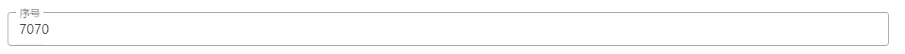

# 序号

序号字段类似数据填报中的流水号，从1生成，可以自动累加。

## 字段属性

### 自定生成并占用

用来控制序号的生成时机，默认为`是`，当表单中显示序号字段时，自动生成序号字段值。

选择为`否`时，序号字段右侧会显示一个名称为`生成并占有`的按钮，当点击按钮时，才会生成序号字段值。

设置为是的显示效果：



设置为否的显示效果：


### 时间维度

时间维度是为序号的生成策略服务的。

- 当某个序号的时间维度设置为`天`时，当日后端生成的序号都是从1开始自增。
- 设置为`周`，则本周后端生成的序号都是从1开始自增，下一周起序号重新从1开始自增。

其他时间维度设置也同理。即在时间维度的范围内，序号都是从1开始自增。

### 单位维度

单位维度是为序号的生成策略服务的。

### 公式

根据公式格式化序号值显示。

语法格式：

```
{deptName}{time}[文号]{index:10}
```

{}内中的字符串为表达式，会被公式解析器解析，其余字符串会原样显示。

表达式由名称和参数两部分显示，`:`前的为表达式名称，`:`后的字符为表达式参数。参数可以省略不写，省略时使用字段配置中的相关属性作为默认参数。

**内置支持的表达式如下：**

- deptName
- time
- index

#### deptName

表示单位(部门)名称，参数表示部门的级别，解析后依据规则替换为对应的部门名称。以下示例假设当前用户科员一所在部门为`演示部门\金融保险部\公文处\科室一`。

**指定参数**

```
{deptName: 1}
```

deptName 支持的参数：

- 1 (表示一级部门)
- 2 (表示二级部门)
- 3 (表示三级部门)
- 4 (表示四级部门)
- 5 (表示本部门)

不同参数和解析结果对应如下：

```
{deptName:1}     ====> 演示部门
{deptName:2}     ====> 金融保险部
{deptName:3}     ====> 公文处
{deptName:4}     ====> 科室一
{deptName:5}     ====> 科室一 
{deptName:8}     ====> 科室一 
```

当参数值大于当前用户所在的部门级别时，则默认显示为`本部门名称`。

** 默认参数 **

```
{deptName}
```

如果没有指定参数，则默认将序号字段属性设置中的单位维度值作为参数值。

不同单位维度和解析结果对应如下：

```
单位维度设置为一级部门  ====> 演示部门
单位维度设置为二级部门  ====> 金融保险部
单位维度设置为三级部门  ====> 公文处
单位维度设置为四级部门  ====> 科室一
单位维度设置为本级部门  ====> 科室一
不设置单位维度         ====> 
```

当序号字段不设置单位维度时 ，则显示为空。

#### time

表示日期时间，参数为日期时间的格式化占位符，解析后依据规则替换为对应的日期时间显示。以下示例假设当前日期为2020年10月10日。

**指定参数**

```
{time: YYYY}
```

日期参数值支持的格式化占位符列表

| 占位符 | 输出             | 详情                     |
| ------ | ---------------- | ------------------------ |
| `YY`   | 18               | 两位数的年份             |
| `YYYY` | 2018             | 四位数的年份             |
| `M`    | 1-12             | 月份，从 1 开始          |
| `MM`   | 01-12            | 月份，两位数             |
| `MMM`  | Jan-Dec          | 缩写的月份名称           |
| `MMMM` | January-December | 完整的月份名称           |
| `D`    | 1-31             | 月份里的一天             |
| `DD`   | 01-31            | 月份里的一天，两位数     |
| `d`    | 0-6              | 一周中的一天，星期天是 0 |
| `dd`   | Su-Sa            | 最简写的星期几           |
| `ddd`  | Sun-Sat          | 简写的星期几             |
| `dddd` | Sunday-Saturday  | 星期几                   |
| `H`    | 0-23             | 小时                     |
| `HH`   | 00-23            | 小时，两位数             |
| `h`    | 1-12             | 小时, 12 小时制          |
| `hh`   | 01-12            | 小时, 12 小时制, 两位数  |
| `m`    | 0-59             | 分钟                     |
| `mm`   | 00-59            | 分钟，两位数             |
| `s`    | 0-59             | 秒                       |
| `ss`   | 00-59            | 秒 两位数                |
| `SSS`  | 000-999          | 毫秒 三位数              |
| `Z`    | +05:00           | UTC 的偏移量，±HH:mm     |
| `ZZ`   | +0500            | UTC 的偏移量，±HHmm      |
| `A`    | AM PM            |                          |
| `a`    | am pm            |                          |
| `Q`    | 1-4              | 季度                     |
| `w`    | 1 2 ... 52 53    | 周数                     |
| `ww`   | 01 02 ... 52 53  | 周数，两位数             |

不同参数对应的解析结果如下:

```
{time:YYYY}         ====> 2020
{time:YYYYMM}       ====> 202010
{time:YYYYMMDD}     ====> 20201010
{time:YYYYQ}        ====> 4
{time:YYYYw}        ====> 41  
```

**默认参数**

```
{time}
```

如果没有指定参数，则默认将序号字段属性设置中的时间维度值作为参数值。

不同时间维度和解析结果对应如下：

```
时间维度设置为年  ====> 2020
时间维度设置为半年  ====> 2020p (如果当前日期为上半年，则显示2020a)
时间维度设置为季度  ====> 20204
时间维度设置为月  ====> 202010
时间维度设置为周  ====> 202041
时间维度设置为天  ====> 20201010
```

当序号字段不设置单位维度时 ，则默认显示为`本部门名称`。

#### index

表示序号，参数表示要显示的序号位数，解析后依据规则会替换成序号值。以下示例假设当前后端生成的序号为100。

**指定参数**

```
{index:8}
```

参数值为大于0的数字，如果生成的序号位数大于设置的参数，则显示生成的序号，不按照设置的参数位数截取。

不同序号位数参数和解析结果对应如下：

```
{index:8}  ====> 00000100
{index:1}  ====> 100
{index:-1}  ====> 100
{index:xxx}  ====> 100
```

当序号参数设置不合法时，显示后端生成的序号。

**默认参数**

```
{index}
```

如果没有指定序号参数，则默认将序号字段属性设置中的序号位数值作为参数值。若生成的序号位数大于属性设置中序号的固定位数，则显示生成的序号，不按照序号的固定位数截取，否则显示的序号位数和属性设置中的固定位数值相等。

### 固定位数

序号字段值的显示位数，当后端生成的序号位数小于设置的固定位数时，在序号之前使用0补全到固定位数显示。比如固定位数设置为6，后端生成的序号值为100，最终表单序号字段的值显示为`000100`。

## 序号值

时间维度和单位维度结合起来会作为序号的一种生成策略。当维度值变化后，序号从1重新生成。