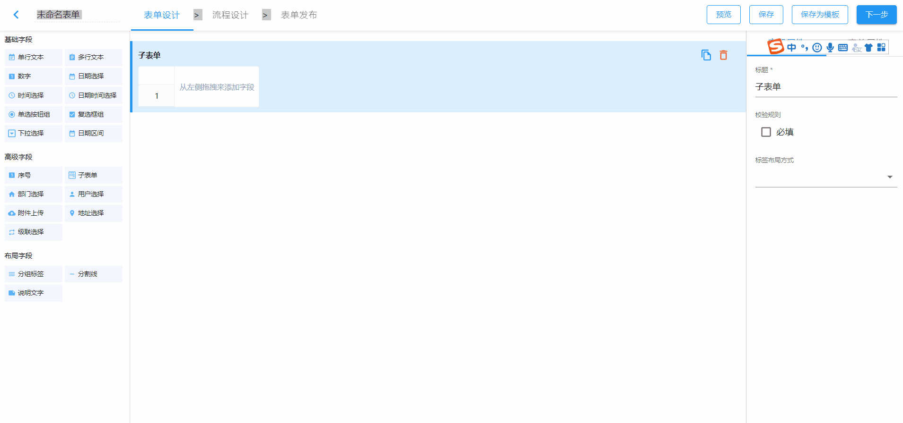
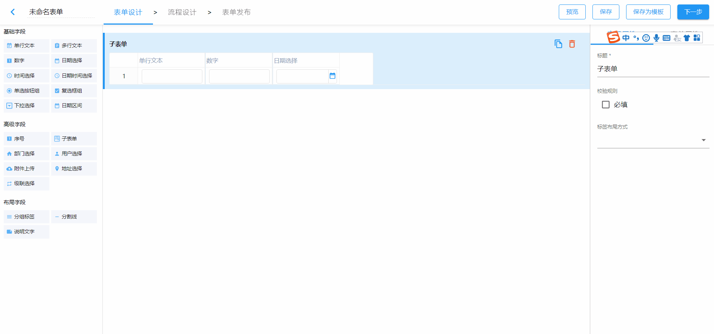
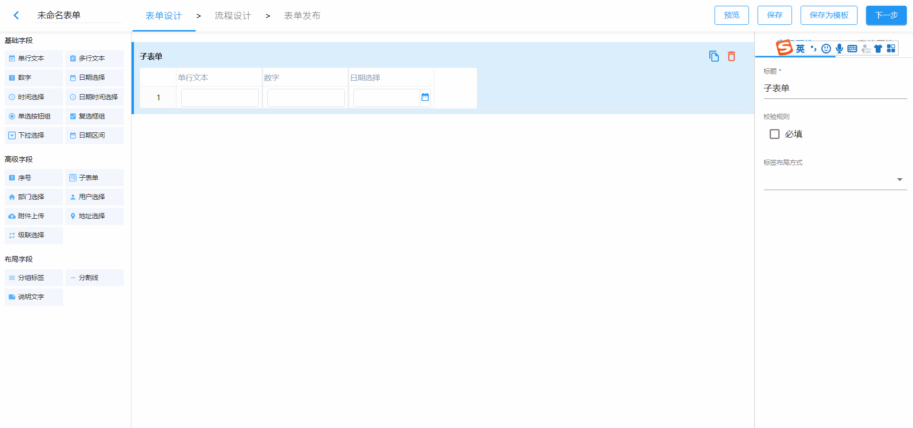
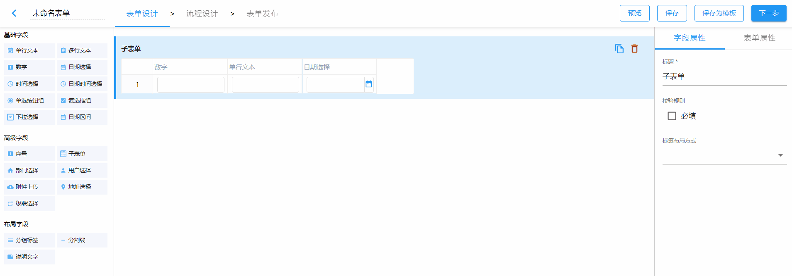
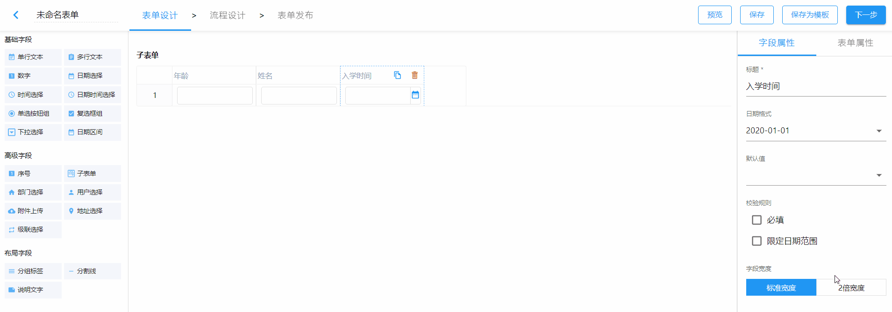

# 子表单

## 字段说明

子表单是用来录入多条数据格式相同的数据的字段。

数据格式一定，是指设计好子表单的子字段后，子表单的每一行都显示同样的子字段。

多条数据，是指在录入数据时可以新建记录，而且新建记录的次数是不受限制的。

## 字段属性

子表单的字段属性，是将子表单作为一个字段整体来生效的。

### 校验规则

仅支持必填校验。若设置为必填，整个子表单的子项都必填。

### 标签布局方式

子表单的标签布局方式支持以下两种：

- 标准布局

  

- 收缩布局

   

## 子字段

### 添加

从表单设置页面的字段区域拖拽一个字段到子表单中。

### 复制

点击选中子表单的子字段后，点击子字段右上方的复制图标，将子字段复制到子表单中。

### 删除

点击选中子表单的子字段后，点击子字段右上方的删除图标，从子表单中删除该子字段。

### 排序

点击选中子表单的子字段后，拖拽子字段进行排序。

### 属性设置

选中单个子字段，即可设置子字段的字段属性。子字段的字段属性设置同主表单中字段属性基本一致。

#### 字段宽度

子字段属性设置中不支持布局设置，可以设置字段宽度为标准宽度或2倍宽度。默认为标准宽度。

## 预览

