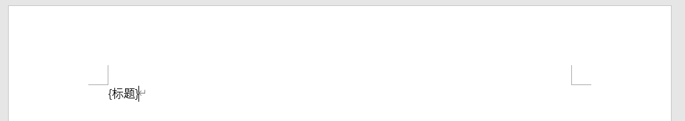
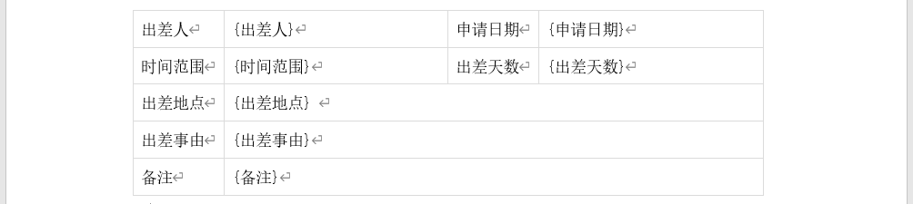

# 打印模板

用户如果想自定义打印输出的内容，需要制作并上传自定义的打印模板。

## 模板语法

模板中需要替换的内容需要用`花括号{}`括起来，打印输出时，程序会将花括号中的内容替换成表单中对应字段项的值。

```txt
{需要打印的表单项}
```

例如，设定了`{标题}`，打印输出时会替换成表单中标题字段的值。

- 如果在打印模板语法上设定了样式，替换后的内容会继承样式

- 模板语法的花括号前不要有手动输入的空格，否则可能会造成打印失败。居中、右对齐等word样式造成的视觉上的空格没有问题。

## 制作模板

### 第一个简易模板制作。

只需要在word中输入**`{想要打印的表单项}`**即可。



如上，最简易的模板制作完成。这个模板只做了一件事，就是打印表单的标题。

### 为模板加上样式

如果感觉模板太单调，可以为这些模板语法加上样式。


### 添加表格

在word中添加表格，然后在对应的表格项中添加需要打印的表单项。



### 子表单、附件上传、审批意见

如果需要打印子表单、附件、审批意见，需要在表单中添加对应的模板配置。


## 模板示例


