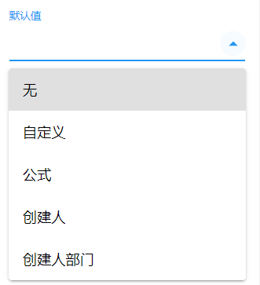
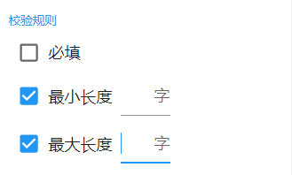

# 单行文本

## 字段说明

单行文本是最基础的字段，在表单中具有广泛的应用，可以用来收集文字等信息。

## 数据格式

在单行文本字段中，系统预设的数据格式，起到字段校验的作用。目前仅支持以下几种：

1. 电话号码

   - 区号-座机号

   - 其中区号可选填

2. 手机号
   
- 1开头的11位数字
  
3. 邮箱地址

   - xxx@xxx.xxx

4. 身份证号

   采用正则表达式进行校验：

   - 身份证长度18位，前17位必然为数字
   - 从第七位开始的六位生日码符合日期校验
   - 最后一位可以是数字、大写X

5. 邮政编码

   - 6位数字

## 默认值

指用户在访问表单时，默认显示的值。单行文本字段支持以下默认值：

## 校验规则

数字字段的校验除了必填设置以外，还支持以下几种校验：

