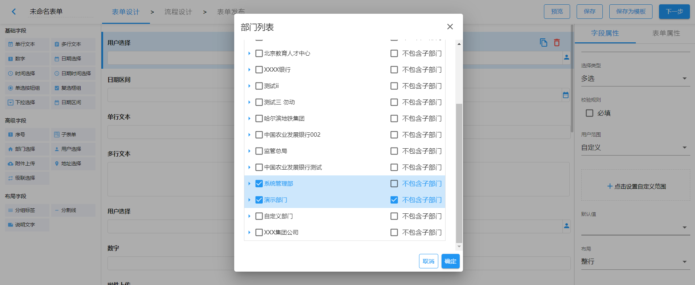
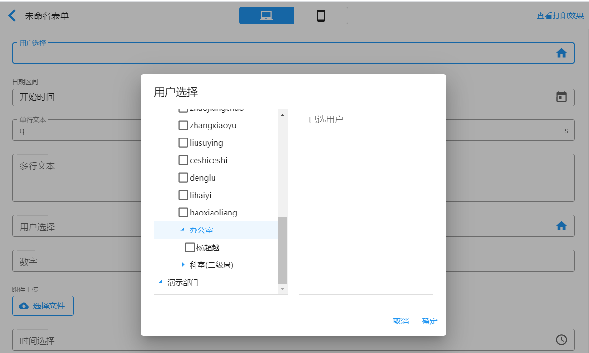

# 用户选择

## 字段说明

用户选择字段支持从组织结构树中选择单个或多个人员。

## 字段属性

### 选择类型

- 单选
- 多选

### 用户范围

用户选择字段的默认范围为全组织机构，并支持以下范围设置：

- 全组织机构
- 本部门
- 自定义
- 来自于部门选择

 **全组织机构**

用户树显示为整个机构下的人员。

**本部门**

用户树只显示为当前操作用户所在本部门下的人员。

**自定义**

用户范围选择为自定义时，需要设置自定义范围。设置自定义范围后，用户树只显示自定义范围下的人员。

自定义范围的设置时，若选中选择的部门同时设置为`不包含子部门`，用户选择树中只显示该选中部门下的人员，不会显示子部门及子部门下的人员。

用户范围按照上图设置后，用户选择字段的用户选择树显示如下图所示：

系统管理部没有设置`不包含子部门`，用户选择树显示系统管理部(包含子部门)的所有用户；演示部门设置为`不包含子部门`，用户选择树只显示演示部门下的用户(示例中演示部门下没有用户，故没有用户显示)。

**来自于部门选择**

用户范围设置为`来自于部门选择`时，用户选择字段的用户树由关联的部门选择字段的值构成。

关联的部门选择属性设置中的选项为当前表单中所有的`部门选择`字段(不包含子表单中的`部门选择`字段)。